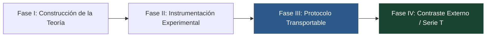

# PROGRAM_STATUS.md: Estado del Programa de Investigación TAKT

**Fecha de Actualización:** 2026-07-24  
**Fase Actual:** Fase III — Congelación Observacional y Transportabilidad del Protocolo (Serie T)  
**Versión Congelada del Core:** v1.2 / R2  

---

## 1. Matriz de Estado del Ciclo de Vida

| Dimensión | Estado | Situación / Evidencia |
| :--- | :--- | :--- |
| **Teoría de Suficiencia Estructural** | **Estable** | Teoremas SPT, cotas de convergencia $\varepsilon$ y métricas $H_{enrichment}$ y $R_2$ congelados en v1.2. |
| **Instrumentación y Runtime** | **Estable** | Arnés de auto-verificación `verify_adapter.py` y esquemas JSON validados. |
| **Serie R (Evidencia Teórica)** | **Completada hasta R2** | Baselines R-000 (AST) y R-001 (Auto-Check) ejecutados con éxito. |
| **Serie T (Transportabilidad)** | **Pendiente de Evidencia Externa** | Pre-registrada. Paquete de replicación autocontenido en `docs/replication/`. |
| **Principal Riesgo Epistemológico** | **Conocimiento Tácito Residual** | Supuestos del autor no explicitados en la documentación. |
| **Próxima Evidencia Crítica** | **T-001 (First Independent Rep.)** | Primera réplica ejecutada por un investigador Nivel 3 sin intervención del autor. |

---

## 2. Fases de Evolución del Programa

* **Fase I (Teoría):** Formulación matemática de la Suficiencia Estructural y la Conservación de Morfismos (SPT).
* **Fase II (Instrumento):** Construcción del Runtime de Gobernanza, puentes de observabilidad y métricas cuantitativas ($H_{enrichment}$, $R_2$).
* **Fase III (Protocolo):** Congelación observacional y creación del Kit de Replicación de Cero-Contacto.
* **Fase IV (Contraste Externo):** Evaluación empírica de la transportabilidad del protocolo por terceros (Serie T).

---

## 3. Reglas de Congelación Observacional y Política de Salida

1. **Protocolo Inmutable por Bloque:** El paquete de replicación (`docs/replication/REPLICATION_KIT/`) permanece inalterado hasta completar un bloque de **$N=3$ réplicas independientes** de la Serie T (o 6 meses de observación pública).
2. **Registro sin Alteración Inmediata:** Cualquier sugerencia o fricción detectada se registra inmediatamente en `TACIT_AUDIT.md`, pero **no modifica el protocolo en curso** para preservar la comparabilidad metrológica entre réplicas.
3. **Condición de Salida (Versión v1.3):** Tras completar el bloque de $N=3$ réplicas, se analiza en conjunto la evidencia acumulada y se emite la versión v1.3 incorporando exclusivamente mejoras justificadas empíricamente.

---

## 4. Guía Rápida para Nuevos Investigadores

Si eres un investigador o desarrollador interesado en probar TAKT de forma independiente:

1. Lee la especificación inmutable en [REPLICATION_SPEC.md](file:///home/valentin/code/takt-theory/docs/replication/REPLICATION_SPEC.md).
2. Consulta la pre-registración de la Serie T en [T_SERIES_PREREGISTRATION.md](file:///home/valentin/code/takt-theory/docs/replication/T_SERIES_PREREGISTRATION.md).
3. Sigue las instrucciones operativas en [REPLICATION_KIT/README.md](file:///home/valentin/code/takt-theory/docs/replication/REPLICATION_KIT/README.md).
4. Registra los resultados utilizando la plantilla en [REPLICATION_REPORT_TEMPLATE.md](file:///home/valentin/code/takt-theory/docs/replication/REPLICATION_REPORT_TEMPLATE.md).
