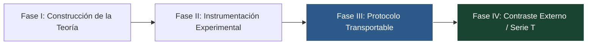

# PROGRAM_STATUS.md: Estado del Programa de Investigación TAKT

**Fecha de Actualización:** 2026-07-29  
**Fase Actual:** Fase III — Congelación Observacional y Transportabilidad del Protocolo (ST-017 Phase III.1 Closed)  
**Versión Congelada del Core:** v1.2 / R2  

---

## 1. Matriz de Madurez y Estado del Ciclo de Vida

| Componente / Dimensión | Nivel de Madurez | Estado Actual y Evidencia |
| :--- | :--- | :--- |
| **Teoría & Núcleo Axiomático** | **Alta Madurez** | Formulada, cotas $\varepsilon$ y teoremas $K_D$, $M_D$ consolidados. Lista para evaluación científica externa. |
| **Formalización Lean 4** | **Muy Alta Madurez** | 226 trabajos compilados con **0 errores y 0 sorrys**. Demostraciones de seguridad y factorización cerradas. |
| **Paquete de Replicación & Kit** | **Calibrado / Calidad Validada** | Saneado mediante la muestra de observadores `T-AI-001` a `T-AI-004`. Calibración de instrumento completada. |
| **Runtime & Infraestructura Operativa** | **Funcional / En Desarrollo** | Motor funcional en TypeScript, pendiente de completar instrumentación avanzada y casos reales heterogéneos. |
| **Adopción Práctica & Uso Continuado** | **Fase Temprana** | En transición desde benchmarks a infraestructura de ejecución en contextos de producción. |

> **Centro de Gravedad Actual:**  
> *El cuello de botella epistemológico (teoría/axiomas) ha sido superado. El centro de gravedad del programa se desplaza de la formulación teórica a la **ingeniería de infraestructura** (véase [OPERATIONAL_ROADMAP.md](docs/OPERATIONAL_ROADMAP.md)), demostrando que la teoría produce sistemas útiles y operativamente medibles fuera de los benchmarks.*

---

## 2. Fases de Evolución del Programa

* **Fase I (Teoría):** Formulación matemática de la Suficiencia Estructural y la Conservación de Morfismos (SPT).
* **Fase II (Instrumento):** Construcción del Runtime de Gobernanza, puentes de observabilidad y métricas cuantitativas ($H_{enrichment}$, $R_2$).
* **Fase III (Protocolo):** Congelación observacional y creación del Kit de Replicación de Cero-Contacto.
* **Fase IV (Contraste Externo):** Evaluación empírica de la transportabilidad del protocolo por terceros (Serie T).

---

## 3. Reglas de Congelación Observacional y Gobernanza

1. **Readiness Freeze Rule (Tras T-000B):** Tras la finalización de T-000B y la congelación del Kit v1.2-R2, **no se aceptará ninguna modificación al paquete de replicación durante la ejecución de la campaña T-001**. Cualquier incidencia o fricción descubierta por los replicadores se registrará en `TACIT_AUDIT.md` y se diferirá obligatoriamente a una revisión posterior del kit (v1.3).
2. **Protocolo Inmutable por Bloque:** El paquete de replicación (`docs/replication/REPLICATION_KIT/`) permanece inalterado hasta completar un bloque de **$N=3$ réplicas independientes** de la Serie T (o 6 meses de observación pública).
3. **Registro sin Alteración Inmediata:** Cualquier sugerencia o fricción detectada se registra inmediatamente en `TACIT_AUDIT.md`, pero **no modifica el protocolo en curso** para preservar la comparabilidad metrológica entre réplicas.
4. **Condición de Salida (Versión v1.3):** Tras completar el bloque de $N=3$ réplicas, se analiza en conjunto la evidencia acumulada y se emite la versión v1.3 incorporando exclusivamente mejoras justificadas empíricamente.
5. **Regla de Bloqueo REV:** **No abrir REV-002 hasta la realización de T-001.** Se prohíbe acumular más revisiones internas o asistidas por IA antes de obtener el primer resultado de replicación independiente externa.

---

## 4. Guía Rápida para Nuevos Investigadores

Si eres un investigador o desarrollador interesado en probar TAKT de forma independiente:

1. Lee la especificación inmutable en [REPLICATION_SPEC.md](docs/replication/REPLICATION_SPEC.md).
2. Consulta la pre-registración de la Serie T en [T_SERIES_PREREGISTRATION.md](docs/replication/T_SERIES_PREREGISTRATION.md).
3. Sigue las instrucciones operativas en [REPLICATION_KIT/README.md](docs/replication/REPLICATION_KIT/README.md).
4. Registra los resultados utilizando la plantilla en [REPLICATION_REPORT_TEMPLATE.md](docs/replication/REPLICATION_REPORT_TEMPLATE.md).
