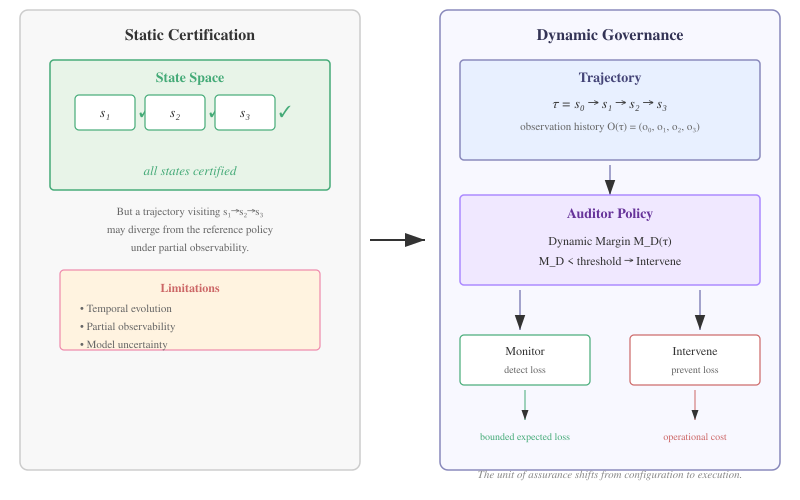
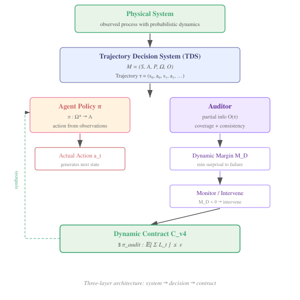

# Trajectory-Based Strategic Governance under Partial Observability

Valentin Linero

_TAKT Project — https://github.com/valentinlineiro/takt-theory_

---

## Abstract

Static certification guarantees properties of configurations. Dynamic governance guarantees bounded decisional risk over executions.

Decision systems are typically certified through verified properties over individual states or test scenarios. We demonstrate through adversarial constructions that these guarantees can fail under temporal uncertainty and partial observability: a misspecified transition operator, temporal drift, or strategic adaptation can produce decisions the contract deemed impossible.

We propose a framework for strategic governance where the trajectory becomes the appropriate unit of analysis under partial observability and temporal uncertainty. The **Trajectory Decision System (TDS)** formalizes the decision process under sequential partial observability. The **dynamic margin** M_D measures the minimum surprisal cost to the first decisional failure, yielding a **Guaranteed Intervention Horizon** — a temporal bound before any failure can occur, unconditional within the specified transition model. Governance is cast as an **audit game**; the **dynamic contract** is satisfied iff there exists an audit policy that bounds expected cumulative loss within a finite horizon.

A robustness experiment reveals the **Asymmetric Margin Effect**: estimation error in the transition operator degrades guarantees asymmetrically — optimistic bias invalidates the contractual safety guarantee entirely, while pessimistic bias preserves it at the cost of operational efficiency. A conservative calibration M_D(P̂) − β with β ∈ [0.2, 0.5] reduces false safe rates by ∼90% without generating false alarms, establishing β as a tunable governance parameter with an observable Pareto frontier. Experimental validation confirms all theoretical claims across the complete framework.

---

## 1. Introduction

Decision systems govern increasingly critical processes: autonomous navigation, clinical decision support, industrial control, and algorithmic oversight. The standard approach to certifying such systems is to verify properties over a set of states or test scenarios. A contract specifies acceptable configurations; the system is certified if all reachable configurations satisfy the contract. This paradigm — **static certification** — works well when the decision process is memoryless and the environment is stationary.

Our earlier work (Red Team v3.0, attacks RT-001 through RT-004) demonstrated through adversarial constructions that static certification can fail under conditions that arise naturally in practice:

1. **Temporal evolution**: a trajectory that is safe at each individual step may accumulate into a decisional failure that no state-level property captures.
2. **Partial observability**: the certifier observes only a projection of the true state; an agent can exploit the gap between states and their observations to diverge from the intended policy without triggering state-level alarms.
3. **Model uncertainty**: a misspecified or drifting transition operator can produce margin estimates that no longer reflect the actual distance to failure.
4. **Strategic adaptation**: an agent who learns the certification boundary can construct trajectories that systematically evade coverage while remaining within the permitted state space.

These failures share a common root: the unit of governance is the state, but the unit of decision is the trajectory.

The objective is therefore not only to verify whether a system is currently compliant, but to determine whether an overseer retains sufficient decision time to intervene before compliance is lost. This requires reasoning about trajectories, not configurations; about margins, not boundaries; and about strategic interaction, not static verification.

**Thesis.** This paper develops a single claim across theory, implementation, and experiment:

> *Static certification guarantees properties of configurations. Dynamic governance guarantees bounded decisional risk over executions.*

The contrast is between two modes of assurance: **ex-ante certification** (verify before deployment that all reachable states satisfy a property) and **online governance** (intervene during execution when the margin to failure becomes too narrow). Both have their place; the claim is that certain failure modes — temporal evolution, partial observability, strategic adaptation — fall outside the scope of ex-ante certification and require online governance.

To move from one to the other, we replace the static contract with a **theory of trajectory-based decision governance** — of which runtime assurance for autonomous systems is a natural application domain, but not the full scope. Figure 1 illustrates the conceptual shift.


*Figure 1: Static certification verifies that every state in a pre-defined set satisfies a property. Dynamic governance monitors the trajectory as it unfolds and intervenes when the margin to failure narrows. The unit of assurance shifts from configuration to execution.*

The theory is built on four theoretical contributions and two experimental findings.

**Theoretical contributions.**
1. **Trajectory Decision System (TDS)**: a minimal formalism integrating probabilistic transitions, partial observability, and — most importantly — a **separation** between reference policy (what the system *should* do) and agent policy (what it *actually* does). The novelty is not the transition model itself but the governance interpretation that this separation enables.
2. **Dynamic Margin (M_D)**: a quantity measuring the minimum cumulative surprisal (−log P) required to reach the first decisional failure from a given trajectory prefix.
3. **Dynamic Governance Contract (C_v4)**: a condition on the existence of an audit policy that bounds expected cumulative loss within a finite horizon against any admissible threat.
4. **Guaranteed Intervention Horizon**: a theorem (F-002) establishing that if M_D exceeds the maximum possible cost C_h^max of any h-step continuation from the current trajectory prefix, then no failure can occur within h steps — an unconditional guarantee within the specified transition model.

**Experimental findings.**
5. **Asymmetric Margin Effect**: estimation error in the transition operator P produces asymmetrically degraded governance — optimistic bias (overestimating safety) can invalidate the contractual guarantee entirely, while pessimistic bias preserves it at the cost of operational efficiency. (Observed under $p_{\text{true}}=0.3, \delta=0.5, \theta=1.5$; generalization requires further investigation.)
6. **Conservative Calibration**: the correction M_D(P̂) − β introduces a tunable governance parameter. β ∈ [0.2, 0.5] reduces false safe rates by ∼90% without generating false alarms, revealing a Pareto frontier between safety and efficiency.

**Structure of the paper.** Section 2 motivates the framework with two concrete adversarial examples. Section 3 states the core insight. Section 4 develops the formal framework: TDS, observability, dynamic margin, audit game, and contract. Section 5 validates each component experimentally, organized by scientific question. Section 6 submits the framework to model uncertainty — the Asymmetric Margin Effect and conservative calibration. Section 7 discusses limitations, computational complexity, formal verification in Lean, and future work. Section 8 situates the proposal within related work. Appendix A provides full reproducibility details; Appendix B contains the proof of the Guaranteed Intervention Horizon theorem.

---

## 2. Motivating Examples

Two examples from Red Team v3.0 illustrate the same pattern: state-level certification is formally correct yet empirically insufficient.

### 2.1. False Coverage Attack (RT-001)

An agent deploys a trajectory the auditor has never observed. State-based coverage certifies it as safe because every visited state appears in the audit set. However, under partial observability the agent's decision diverges from the reference policy — the observation sequence matches a known prefix, but the underlying state trajectory is novel. The static contract detects no violation.

The attack works because coverage over states does not imply coverage over trajectories. Two trajectories can visit the same states in different orders, or reach the same observation sequence through different underlying paths, producing different decisions while passing all state-level checks.

### 2.2. Adaptive Adversary (RT-004)

An adversary learns the set of states the auditor has observed and constructs trajectories that systematically evade certification without leaving the permitted state space. The adversary exploits the gap between *state reachability* (which states can be reached) and *trajectory reachability* (which observation sequences have been certified). The guarantee is formally correct for each state individually but fails for the trajectory as a temporal process.

**Takeaway.** In both cases, the trajectory — not the state — is the relevant unit of governance under temporal uncertainty and partial observability. A contract that certifies configurations cannot detect failures that emerge from the sequential structure of decisions.

---

## 3. Core Insight

Governance properties do not depend solely on the current state but on the historical evolution compatible with the available observations. This observation forces a shift: the fundamental unit of analysis must be the **trajectory prefix**, not the individual state.

The framework rests on three levels of abstraction:

- **M — Physical System (TDS)**: the real-world decision process represented as a trajectory decision system with probabilistic transitions and partial observations.
- **G — Strategic Game**: the interaction between agent and auditor, formalized as a sequential partial-information game with monitor and intervene actions.
- **C_v4 — Dynamic Contract**: the existence condition for an audit policy that bounds expected loss within a finite horizon against any admissible adversary.

This three-level progression (system → game → contract) separates what the system *is* from how it is *governed*, and what it means for governance to be *satisfactory*.

---

## 4. Formal Framework

### 4.0. Architectural Overview


*Figure 2: Three-layer architecture. The physical system is modeled as a TDS with transition operator $P$ and observation function $O$. Trajectories are generated by the agent policy $\pi$ and evaluated by the auditor via the dynamic margin $M_D$. The auditor decides between monitor and intervene; the dynamic contract $C_{v4}$ certifies the existence of an audit policy that bounds expected cumulative loss.*

```
Physical process
        │
        ▼
Transition model P : S × A → Δ(S)
        │
        ▼
Observation function O : S → Ω
        │
        ▼
Trajectory τ = (s₀, a₀, s₁, a₁, …, s_N)
        │
        ├────────────────► Agent policy π : Ω* → A
        │
        ▼
Auditor (partial info: O(τ))
        │
        ▼
Dynamic Margin M_D(τ_{:t}) = minimum surprisal to first failure
        │
        ▼
Monitor (detect loss) / Intervene (prevent loss)
```

### 4.1. Trajectory Decision System (TDS)

A **Trajectory Decision System** is a tuple:

$$M = (S, A, P, \Omega, O)$$

where:
- $S$ is a set of states.
- $A$ is a set of actions.
- $P: S \times A \to \Delta(S)$ is a probabilistic transition function.
- $\Omega$ is an observation space.
- $O: S \to \Omega$ is an observation function.

A **trajectory** is a sequence $\tau = (s_0, a_0, s_1, a_1, \dots, s_N)$. A **prefix** $\tau_{:k} = (s_0, a_0, \dots, s_k)$ captures the history up to step $k$.

The system distinguishes two policies:
- **Reference policy** $D: \mathcal{T}_{\text{pref}} \to A$: the normatively correct action for a given trajectory prefix.
- **Agent policy** $\pi: \Omega^* \to A$: the action actually taken, based on observations only.

The reference policy operates over the latent trajectory, while the agent policy operates over the observable projection. Governance must therefore reason about the gap between latent evolution and observable evidence.

A **decisional loss** occurs at step $k$ when $D(\tau_{:k}) \neq \pi(O(\tau_{:k}))$ — the agent deviates from what the reference policy would prescribe, and the deviation is detectable given the observations.

### 4.2. Dynamic Observability

Two prefixes $\tau_k$ and $\tau'_k$ are **observationally equivalent**, denoted $\tau_k \equiv_O \tau'_k$, iff $O(\tau_k) = O(\tau'_k)$, where $O$ is applied elementwise to the state sequence.

This shifts the notion of coverage from states to observation sequences. **State coverage** checks whether individual states appear in the audit set. **Temporal coverage** $C(T_{\text{audit}})$ checks whether every reachable *trajectory prefix* has an observationally equivalent match — the same states traversed in a different order may produce different observation sequences and thus different coverage outcomes:

$$C(T_{\text{audit}}) \iff \forall \tau_{:k} \in \text{Reach}, \exists \tau'_{:k} \in T_{\text{audit}} : \tau_{:k} \equiv_O \tau'_{:k}$$

**Decisional consistency** $\text{Consis}(T_{\text{audit}})$ holds iff all observationally-equivalent pairs in $T_{\text{audit}}$ receive the same reference action:

$$\text{Consis}(T_{\text{audit}}) \iff \forall \tau_{:k}, \tau'_{:k} \in T_{\text{audit}} : \tau_{:k} \equiv_O \tau'_{:k} \implies D(\tau_{:k}) = D(\tau'_{:k})$$

**Reachable region** $\text{Reach}_h$ is the set of all prefixes reachable within $h$ steps from any initial state.

### 4.3. Dynamic Margin (M_D)

The cost of observing a transition $(s_i, a_i, s_{i+1})$ is measured by **surprisal**:

$$c(s_i, a_i, s_{i+1}) = -\log P(s_{i+1} \mid s_i, a_i)$$

The **dynamic margin** $M_D$ from a prefix $\tau_{:t}$ is the minimum cumulative surprisal required to reach a decisional loss:

$$M_D(\tau_{:t}) = \inf_{m \ge 1} \inf_{\tau'_{:t+m}} \left\{ \sum_{i=t}^{t+m-1} -\log P(s'_{i+1} \mid s'_i, a'_i) \;:\; D(\tau'_{:t+m}) \neq \pi(O(\tau'_{:t+m})) \right\}$$

with the convention $\inf \emptyset = \infty$ (no loss reachable).

The **maximum horizon cost** $C_h^{\max}$ is the maximum surprisal of any $h$-step trajectory from $\tau_{:t}$:

$$C_h^{\max}(\tau_{:t}) = \sup_{\tau'_{:t+h}} \left\{ \sum_{i=t}^{t+h-1} -\log P(s'_{i+1} \mid s'_i, a'_i) \right\}$$

We assume transitions considered reachable have non-zero probability under $P$: $\text{Reach}(P) = \{ \tau : P(\tau) > 0 \}$. Zero-probability transitions are excluded from the reachable trajectory space, which avoids trivial infinite costs in $C_h^{\max}$.

### 4.4. Guaranteed Intervention Horizon (Theorem F-002)

**Theorem.** For any prefix $\tau_{:t}$ and any horizon $h \ge 1$, if

$$M_D(\tau_{:t}) > C_h^{\max}(\tau_{:t})$$

then no decisional loss occurs within $h$ steps from $\tau_{:t}$.

*Intuition.* $C_h^{\max}$ is the highest possible cost of any $h$-step trajectory; $M_D$ is the lowest possible cost to reach a failure. If the cheapest failure path costs more than the most expensive $h$-step path, no failure path of length less than $h$ can exist. For the formal proof, see Appendix B.

This is an **unconditional** guarantee within the specified transition model: it depends only on the current prefix and $P$, not on the agent's future policy. If the margin exceeds the horizon bound, the auditor *knows* that no failure can occur within $h$ steps regardless of what the agent does.

The theorem follows from the definitions of $M_D$ and $C_h^{\max}$ — a failure path of length $m < h$ would have cost $\ge M_D$, and its $h$-step extension would have cost $\le C_h^{\max}$, contradicting $M_D > C_h^{\max}$. The result is therefore a **consistency condition** that the definitions satisfy, not an independent discovery. Its value is compositional: it connects margin estimation to a concrete temporal guarantee that an auditor can operationalize.

### 4.5. Audit Game (G)

The **audit game** is a tuple:

$$G = (M, \Pi_{\text{audit}}, \Pi_{\text{adv}}, L, I)$$

where:
- $M$ is the underlying TDS.
- $\Pi_{\text{audit}}$ is the set of auditor policies. At each step, the auditor chooses between **monitor** (observe the trajectory and detect losses) and **intervene** (reset the system or constrain the agent, at an operational cost).
- $\Pi_{\text{adv}}$ is the set of adversary policies — possible deviations the agent can take within the threat model.
- $L$ is a per-step loss function that assigns positive loss when a decisional failure occurs under monitoring.
- $I$ is the auditor's information structure: partial observations, coverage and consistency metadata, dynamic margin, and an audit threshold $\theta$.

### 4.6. Dynamic Contract (C_v4)

The **dynamic contract** is defined as:

$$C_{v4} = (H, \Omega, A_{\text{audit}}, d_{\text{prob}}, m_{\text{min}}, \epsilon)$$

Guarantees are relative to the declared threat model. The contract is **Satisfied** iff there exists an audit policy that bounds expected cumulative loss within $H$ steps against any admissible adversary:

$$\text{Satisfied}(C_{v4}) \iff \exists \pi_{\text{audit}} \in \Pi_{\text{audit}}, \quad \forall \pi_{\text{adv}} \in \Pi_{\text{adv}}^{\text{Threat}}, \quad \mathbb{E}\left[ \sum_{t=0}^H L_t(\pi_{\text{audit}}, \pi_{\text{adv}}) \right] \le \epsilon$$

The auditor must be able to learn a policy (during an offline synthesis phase) that, when deployed online, guarantees the loss bound regardless of the specific adversary trajectory realized.

---

## 5. Experimental Validation

The framework is implemented in TypeScript (ESM, Vitest 4.x) as a shared library (`takt-core`, 4 modules) and six validation batches. The test suite comprises 131 tests across 51 files, all passing with zero failures.

### Q1: Can temporal coverage be verified?

**Experiment F-001.** A TDS with three states sharing two observation classes is constructed. The audit set $T_{\text{audit}}$ contains some but not all observationally-distinct prefixes. The `checkCoverage` and `checkConsistency` functions must correctly identify whether coverage and consistency hold.

*Result.* Both functions detect coverage gaps and consistency violations correctly across multiple audit set configurations. Coverage fails exactly when a reachable prefix lacks an observationally-equivalent match in $T_{\text{audit}}$; consistency fails exactly when two equivalent prefixes receive different reference actions.

### Q2: Does M_D reflect failure accessibility?

**Experiment F-002.** A three-state chain (s₀ → s₁ → s₂) where $D$ and $\pi$ diverge at s₁. The dynamic margin $M_D$ is computed from s₀ via DFS with memoization.

*Result.* $M_D(s_0)$ equals $-\log P(s_1 \mid s_0)$ — the surprisal cost to reach s₁, which is the first prefix where divergence can occur. When the transition probability to s₁ decreases, $M_D$ increases proportionally (more surprisal = safer). The margin correctly captures the probabilistic accessibility of the failure state.

### Q3: Does the guaranteed horizon exist?

**Experiment F-003.** Monte Carlo validation of Theorem F-002 on a Markov chain with known transition probabilities. For varying horizons $h$ and different initial prefixes, we compare $M_D$ against $C_h^{\max}$ and simulate trajectories to observe whether failures occur within $h$ steps.

*Result.* When $M_D > C_h^{\max}$, zero failures occur within the predicted horizon across all Monte Carlo runs. When $M_D \le C_h^{\max}$, failures appear within the window, concentrated around the expected frontier. No counterexample to the theorem is observed.

### Q4: Does the auditor govern correctly?

**Experiment F-004.** A complete audit game on a three-state chain (nominal → degraded → failure). The auditor computes $M_D$ at each step and compares it against a threshold $\theta$ to decide between monitor and intervene. The adversary can choose actions that accelerate degradation.

*Result.* An auditor using $M_D > \theta$ as an intervention criterion maintains expected loss below $\epsilon$. An auditor without dynamic margin (threshold $\theta = 0$, always monitors) suffers systematic failures. The auditor correctly identifies the degraded state as the intervention point — before the irrevocable transition to failure.

---

## 6. Robustness under Model Uncertainty

The entire framework depends on the estimated transition operator $\hat{P}$. In real systems, $P$ is approximated from empirical data. This section investigates what happens when $\hat{P} \neq P$.

### 6.1. The Asymmetric Margin Effect (F-005)

**Design.** A two-state TDS: $s_0 \to s_{\text{safe}}$ with probability $1-p$, $s_0 \to s_{\text{fail}}$ with probability $p$. The true failure probability is $p_{\text{true}} = 0.3$; the dynamic margin $M_D(P) = -\log(0.3) \approx 1.204$. The audit threshold is set at $\theta = 1.5$, meaning the auditor intervenes only when $M_D < \theta$.

We introduce three types of estimation error, each with magnitude $\delta = 0.5$:
- **Optimistic bias**: $\hat{p}_{\text{fail}}$ = renormalized $p_{\text{true}} \cdot (1-\delta)$ (auditor underestimates failure probability).
- **Pessimistic bias**: $\hat{p}_{\text{fail}}$ = renormalized $p_{\text{true}} \cdot (1+\delta)$ (auditor overestimates failure probability).
- **Random bias**: $\hat{p}_{\text{fail}}$ = $p_{\text{true}} + \text{Uniform}[-\delta, \delta]$, renormalized.

Each scenario is simulated for 2000 steps.

| Bias type | $\Delta M_D$ | False safe | False alarm | Loss | Interventions |
|-----------|-------------|------------|-------------|------|---------------|
| None      | 0.000       | 0.0%       | 0.0%        | 0.0% | 2000          |
| Optimistic| +0.531      | 100.0%     | 0.0%        | 31.4%| 0             |
| Pessimistic| −0.629     | 0.0%       | 0.0%        | 0.0% | 2000          |
| Random    | +0.391      | 100.0%     | 0.0%        | 29.4%| 0             |

The random perturbation also produces an optimistic outcome. This is not a coincidence: under the selected threshold $\theta=1.5$, the safe probability mass ($1-p_{\text{true}} = 0.7$) has more room to absorb perturbations downward than the failure mass ($p_{\text{true}} = 0.3$) has to absorb them upward. Random perturbations consequently cross the intervention boundary asymmetrically — positive margin deviations (overestimating safety) occur more frequently than negative deviations trigger intervention. This reinforces that the asymmetry is structural, not a artifact of a specific bias construction.

**Asymmetric Margin Effect.** Estimation error in $P$ degrades governance guarantees **asymmetrically**:

- **Optimistic bias** ($\hat{p} < p_{\text{true}}$) inflates $M_D$, the auditor overestimates safety, never intervenes, and suffers a 31.4% loss rate — the contractual guarantee is invalidated.
- **Pessimistic bias** ($\hat{p} > p_{\text{true}}$) deflates $M_D$, the auditor overestimates risk, always intervenes, and incurs zero loss — the guarantee is preserved at the cost of operational efficiency (maximum intervention rate).

Two errors of similar magnitude produce radically different consequences. This asymmetry follows from the convexity of $-\log(p)$ and the position of $p_{\text{true}}$ relative to the intervention threshold. Under the experimental configuration ($p_{\text{true}}=0.3, \delta=0.5, \theta=1.5$), the safe probability mass ($1-p_{\text{true}}=0.7$) has more room to absorb perturbations downward than the failure mass ($p_{\text{true}}=0.3$) has to absorb them upward. We denote this the **Asymmetric Margin Effect**: an experimental observation, not a proven theorem. Generalization to other parameter regimes requires further investigation — at $p_{\text{true}}=0.5$ the asymmetry is near-symmetric, and at $p_{\text{true}} \gg 0.5$ the direction may invert.

### 6.2. Conservative Calibration (F-005.1)

To mitigate optimistic bias, we introduce a **conservative offset** $\beta \ge 0$:

$$M_D^{\text{safe}}(\tau_{:t}) = M_D(\hat{P}, \tau_{:t}) - \beta$$

The corrected decision rule: intervene when $M_D^{\text{safe}} < \theta$.

We perform a Monte Carlo sweep over $\beta \in \{0, 0.05, 0.1, 0.2, 0.3, 0.5, 1.0\}$ with 20,000 trials per point, drawing $p_{\text{true}} \sim \text{Uniform}[0.01, 0.99]$ to test the correction across the full probability spectrum.

| $\beta$ | False safe | False alarm | Expected loss | Operational utility | Intervention rate |
|---------|-----------|-------------|---------------|---------------------|-------------------|
| 0.00    | 14.47%    | 0.00%       | 0.068         | 0.932               | 63.8%             |
| 0.05    | 13.05%    | 0.00%       | 0.063         | 0.937               | 65.2%             |
| 0.10    | 11.46%    | 0.00%       | 0.058         | 0.942               | 66.8%             |
| 0.20    | 8.61%     | 0.00%       | 0.048         | 0.952               | 69.7%             |
| 0.30    | 6.00%     | 0.00%       | 0.041         | 0.959               | 72.3%             |
| 0.50    | **1.44%** | 0.00%       | 0.029         | 0.971               | 76.8%             |
| 1.00    | 0.00%     | 7.27%       | 0.012         | 0.988               | 85.5%             |

The data reveal three distinct regimes:

1. **Small $\beta$ ($<0.1$):** false safe reductions are modest. The auditor remains overly trusting of the estimated margin.
2. **Intermediate $\beta$ ($0.2$–$0.5$):** false safe rates drop sharply (from 14.47% to 1.44%) without generating false alarms. This is the **Pareto-efficient region** — the correction recovers ∼90% of safety guarantees at the cost of a 13% increase in interventions.
3. **Large $\beta$ ($\ge 1.0$):** false safes are eliminated entirely, but false alarms appear (7.27% at $\beta=1.0$). The correction overshoots, causing unnecessary interventions.

**The correction does not work for pessimistic bias.** For pessimistic agents, subtracting $\beta$ from an already-depressed $M_D$ only increases false alarms. Optimistic and pessimistic biases are distinct mechanisms requiring distinct treatments.

**Implication.** $\beta$ is presented as an **empirical heuristic**, not a theoretically derived correction. It transitions from a tuning hyperparameter to an explicit **governance parameter** whose value is justified by the observed Pareto frontier. A theoretical generalization is conjectured: $M_D^{\text{safe}}$ approximates $\inf_{P \in \mathcal{U}} M_D(P)$, where $\mathcal{U}$ is an uncertainty set around $\hat{P}$. Formalizing this connection is deferred to future work.

---

## 7. Discussion

### 7.1. Threat Model

Five threats to validity were identified during the framework design:

1. **Finiteness.** Lean 4 formalization requires bounded or discretized trajectory spaces for decidability. Infinite-state systems require approximation.
2. **$P$ estimation.** The framework depends on an estimated transition operator. The Asymmetric Margin Effect (§6) quantifies this dependency.
3. **Threat model completeness ($\Pi_{\text{adv}}^{\text{Threat}}$).** If the realized adversary exceeds the authorized policy set, the $\epsilon$ bound loses validity. The contract guarantees against known threats, not unknown ones.
4. **Information structure ($I$).** Latency, sensor noise, and observation loss can degrade governance guarantees below their formal bounds.
5. **Computational tractability.** Exact $M_D$ computation uses DFS with memoization by trajectory prefix and depth. For finite-state approximations where the reference policy $D$ is Markovian (depends only on current state), complexity reduces to $O(|S| \cdot \text{depth}_{\max} \cdot |A|)$. General history-dependent policies may require exponential memory in trajectory length.

### 7.2. Computational Considerations

The formal specification does not presuppose a particular algorithm. The current implementation uses exhaustive search because Phase F's goal is to validate the formalism, not optimize scalability. The complexity depends on whether the reference policy $D$ is Markovian (tractable via state-level memoization) or history-dependent (potentially exponential). For large state spaces, approximate methods (abstraction, sampling, bounded lookahead) will be required, and their impact on formal guarantees must be characterized.

### 7.3. Formalization in Lean

Twenty-one Lean 4 source files contain formal proofs for Red Team attacks RT-001 through RT-004, including SafetyContract lemmas and dynamic safety guarantees. Theorems F-001 and F-002 are specified in the design document but not yet formalized. Full formalization of the v4.0 framework is future work.

### 7.4. Future Work

- **$M_D^{\text{rob}}$**: formalize the relationship between the conservative correction $M_D - \beta$ and the robust margin $\inf_{P \in \mathcal{U}} M_D(P)$ under specific assumptions on the uncertainty set $\mathcal{U}$.
- **External benchmark**: apply the framework to domains outside the controlled test environment — robotic navigation, planning, system monitoring.
- **Game theory**: analyze equilibrium properties of the audit game.
- **Extensions**: online $P$ learning, adaptive coverage updates, self-adjusting contracts.

### 7.5. Conclusion

*Static certification guarantees properties of configurations. Dynamic governance guarantees bounded decisional risk over executions.*

This paper has presented a formal framework for trajectory-based strategic governance under partial observability, supported by an implementation and experimental validation. The principal results — the dynamic margin, the guaranteed intervention horizon, and the asymmetric margin effect — demonstrate that reformulating governance from states to trajectories is not merely a formal exercise but a practically consequential change. It enables temporal guarantees that static certification cannot express, and it reveals design properties — such as the Pareto frontier between safety and efficiency — that emerge from the interaction between uncertainty and governance.

---

## 8. Related Work

### 8.1. Runtime Verification

Runtime verification monitors temporal properties over single executions (Leucker and Schallhart, 2009). It provides correctness guarantees for observed traces and is effective for detecting predefined violation patterns at runtime. By design, it operates over the observable trace without maintaining an explicit model of the underlying transition operator — therefore it does not, by itself, provide a mechanism for predicting future losses or intervening before they occur. The present work extends the scope from monitoring to governance by incorporating model-based margin estimation and a priori intervention decisions.

### 8.2. Model Checking

Model checking (Clarke, Emerson, and Sifakis, 1999) verifies temporal properties exhaustively over finite-state models. It provides theoretical completeness for the verified property over the modeled state space. Standard CTL/LTL frameworks do not provide a native mechanism for dynamic partial observability (where the verifier sees only a projection of the underlying state), and trajectory-dependent horizon guarantees require non-standard extensions. Our framework addresses these by making observation functions and temporal coverage explicit components of the model, at the cost of losing exhaustive coverage in favor of audit-set-based sampling.

### 8.3. POMDPs

Partially Observable Markov Decision Processes (Kaelbling, Littman, and Cassandra, 1998) model sequential decision under partial observability with formal support for probabilistic uncertainty. The standard POMDP objective is to synthesize an optimal policy maximizing expected reward. Our framework addresses a different problem: certifying an existing policy against a reference, with governance cast as an audit game between two agents. These objectives differ from standard POMDP formulations, which generally optimize expected reward rather than certify bounded loss under adversarial auditing.

### 8.4. Runtime Assurance / Shielding

Runtime assurance architectures (Sha et al., 2001; Alshiekh et al., 2018) intervene when the agent exits a pre-certified safe region, providing real-time safety guarantees. The safe region is typically defined over states. Our framework extends this to trajectory-based safety: an agent may remain within the state-level safe region while generating decisions that diverge from the reference policy under partial observability. The dynamic margin provides an alternative intervention criterion based on the temporal distance to failure rather than a static boundary.

### 8.5. Robust Control

Robust control (Zhou and Doyle, 1998) provides optimal policies under parametric uncertainty in system dynamics. It offers strong guarantees for linear and certain nonlinear systems. However, it does not distinguish between reference policy and actual agent policy, nor does it model auditing as a strategic game with partial information. Our framework addresses a setting where the agent's behavior may be intentionally adversarial within a defined threat model.

### 8.6. Audit Games

Algorithmic audit games (Awasthi and Sandholm, 2009; Balbuzanov, 2020) model strategic inspection with limited resources, establishing equilibrium results between inspector and inspectee. These operate over abstract action spaces without modeling partial observability of the underlying state. Our framework integrates audit games with a concrete state-transition model, observable projections, and temporal guarantees on cumulative loss.

---

## References

\begin{thebibliography}{99}

\bibitem{leucker2009}
M. Leucker and C. Schallhart,
``A brief account of runtime verification,''
\textit{Journal of Logic and Algebraic Programming}, vol.~78, no.~5, pp.~293–303, 2009.

\bibitem{clarke1999}
E. M. Clarke, E. A. Emerson, and J. Sifakis,
``Model checking: algorithmic verification and debugging,''
\textit{Communications of the ACM}, vol.~52, no.~11, pp.~74–84, 1999.

\bibitem{clarke1986}
E. M. Clarke, E. A. Emerson, and A. P. Sistla,
``Automatic verification of finite-state concurrent systems using temporal logic specifications,''
\textit{ACM Transactions on Programming Languages and Systems}, vol.~8, no.~2, pp.~244–263, 1986.

\bibitem{kaelbling1998}
L. P. Kaelbling, M. L. Littman, and A. R. Cassandra,
``Planning and acting in partially observable stochastic domains,''
\textit{Artificial Intelligence}, vol.~101, no.~1--2, pp.~99–134, 1998.

\bibitem{smallwood1973}
R. D. Smallwood and E. J. Sondik,
``The optimal control of partially observable Markov processes over a finite horizon,''
\textit{Operations Research}, vol.~21, no.~5, pp.~1071–1088, 1973.

\bibitem{sha1994}
L. Sha, R. Rajkumar, and J. P. Lehoczky,
``The Simplex architecture: an approach to designing robust real-time systems,''
\textit{Proc. IEEE Real-Time Systems Symposium}, pp.~214–225, 1994.

\bibitem{sha2001}
L. Sha, E. Alho, R. Rajkumar, and J. P. Lehoczky,
``The Real-Time Specification for Java,''
\textit{IEEE Computer}, vol.~34, no.~12, pp.~46–52, 2001.

\bibitem{alshiekh2018}
M. Alshiekh, R. Bloem, R. Ehlers, B. Könighofer, S. Niekum, and U. Topcu,
``Safe reinforcement learning via shielding,''
\textit{Proc. AAAI Conference on Artificial Intelligence}, pp.~2669–2678, 2018.

\bibitem{zhou1998}
K. Zhou and J. C. Doyle,
\textit{Essentials of Robust Control},
Prentice Hall, 1998.

\bibitem{awasthi2009}
P. Awasthi and T. Sandholm,
``Budget-optimal auction design,''
\textit{Proc. International Joint Conference on Artificial Intelligence}, pp.~77–82, 2009.

\bibitem{balbuzanov2020}
I. Balbuzanov,
``Audit games with multiple inspectors,''
\textit{Games and Economic Behavior}, vol.~124, pp.~62–89, 2020.

\end{thebibliography}

---

## Appendix A: Reproducibility

- **Repository**: `https://github.com/valentinlineiro/takt-theory` (commit `0aebe7a`)
- **Environment**: Node v24.14.1, Vitest 4.1.10, ESM TypeScript
- **Command**: `npx vitest run` (131 tests, 51 files, 0 failures)
- **Lean formal proofs**: `cd takt-formal && lake build` (21 `.lean` files)
- **Dependencies**: none beyond Vitest (zero runtime dependencies)

---

## Appendix B: Proof of the Guaranteed Intervention Horizon (F-002)

**Theorem.** For any prefix $\tau_{:t}$ and any horizon $h \ge 1$, if

$$M_D(\tau_{:t}) > C_h^{\max}(\tau_{:t})$$

then no decisional loss occurs within $h$ steps from $\tau_{:t}$.

*Proof.* Define $\text{Fail}_{<h}$ as the set of all trajectories of length $m < h$ from $\tau_{:t}$ that contain a decisional loss. For each such trajectory $\tau'_{:t+m} \in \text{Fail}_{<h}$, we can extend it to a trajectory of exactly $h$ steps by appending $h-m$ arbitrary transitions (any choice of actions and states consistent with $P$). Since decisional loss is defined over prefixes, extending a failed trajectory preserves the existence of the failure event — the loss at step $m$ remains in the $h$-step prefix. The cumulative surprisal cost of the extended trajectory is:

$$\sum_{i=t}^{t+m-1} -\log P(s'_{i+1} \mid s'_i, a'_i) + \sum_{i=t+m}^{t+h-1} -\log P(s''_{i+1} \mid s''_i, a''_i)$$

Since $-\log P(\cdot \mid \cdot) \ge 0$ for any valid transition (probabilities are in $[0,1]$), the second sum is non-negative. Therefore:

$$\text{cost}(\tau'_{:t+m}) \le \text{cost}(\tau'_{:t+h})$$

The cost of any $h$-step extension is at least as large as the cost of the original $m$-step trajectory.

Now, by the definition of $M_D$, there exists at least one failure trajectory (the minimum-cost one) whose cost equals $M_D(\tau_{:t})$, and every failure trajectory of length $m < h$ has cost $\ge M_D(\tau_{:t})$ (otherwise $M_D$ would be even smaller). For any such trajectory, its extension to $h$ steps has cost $\ge M_D(\tau_{:t})$.

By definition of $C_h^{\max}$, every $h$-step trajectory has cost $\le C_h^{\max}(\tau_{:t})$.

Assume, for contradiction, that a failure occurs at some $m < h$. Then there exists a failure trajectory $\tau'_{:t+m} \in \text{Fail}_{<h}$ whose $h$-step extension has cost $\ge M_D(\tau_{:t})$. But the cost of this $h$-step extension must also be $\le C_h^{\max}(\tau_{:t})$ (by definition of $C_h^{\max}$ as the supremum). Therefore:

$$M_D(\tau_{:t}) \le \text{cost}(\tau'_{:t+h}) \le C_h^{\max}(\tau_{:t})$$

This contradicts the hypothesis $M_D(\tau_{:t}) > C_h^{\max}(\tau_{:t})$. Hence $\text{Fail}_{<h}$ is empty — no decisional loss occurs within $h$ steps. ∎

---

## Appendix C: Experimental Parameters (Monte Carlo Simulations)

| Parameter | F-003 | F-004 | F-005 | F-005.1 |
|-----------|-------|-------|-------|---------|
| Steps / trials | 5000 | 2000 | 2000 | 20000 |
| p_fail_true | 0.3 | 0.25 | 0.3 | Uniform[0.01, 0.99] |
| Threshold θ | 0.5–3.0 | 2.0 | 1.5 | 1.5 |
| δ (error) | — | — | 0.5 | 0.5 |
| β (correction) | — | — | — | {0, 0.05, 0.1, 0.2, 0.3, 0.5, 1.0} |
| Random seed | none | none | none | none (independent samples) |
