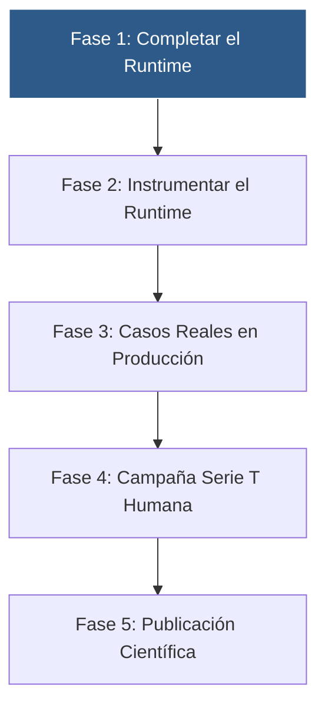

# TAKT Operational Engineering Roadmap (2026-2027)

**Fecha de Formalización:** 2026-07-24  
**Enfoque Estratégico:** Transición de la Formulación Teórica a la Infraestructura de Ejecución Operativa  
**Principio Rector:** *Acumular Evidencia Empírica de Infraestructura antes de Añadir Capas Teóricas Adicionales*

---

## 1. Cadena de Dependencias Operacionales

---

## 2. Definición Detallada de las 5 Fases

### Fase 1: Completar el Runtime (Máxima Prioridad)
* **Objetivo:** Cerrar el motor de ejecución en TypeScript (`cli/src/runtime/`) eliminando comportamientos provisionales y stubs restantes.
* **Hitos Clave:**
  1. Completar la integración del modelo de capacidades y enriquecimiento en `GovernanceStateMachine.ts`.
  2. Integrar completamente el planificador dinámico con la tubería de ejecución operativa (`CertifiedRuntimePipeline.ts`).
  3. Garantizar que **el $100\%$ de las decisiones relevantes del sistema pasen explícitamente por la gobernanza de TAKT** sin atajos ni rutas especiales.
* **Criterio de Salida:** El runtime ejecuta el ciclo de vida completo de decisión de forma autocontenida y sin componentes pendientes.

### Fase 2: Instrumentar el Runtime
* **Objetivo:** Convertir el runtime en un instrumento cuantitativo de observación metrológica.
* **Métricas Operacionales a Registrar:**
  * Tiempo invertido por fase de decisión ($\Delta t_{\text{phase}}$).
  * Frecuencia de refinamiento de estado y solicitudes de enriquecimiento.
  * Tasa de reapertura de decisiones ($\text{ReopenCount}$).
  * Incertidumbre residual del espacio de representación antes y después del enriquecimiento ($\epsilon_{\text{before}} \to \epsilon_{\text{after}}$).
  * Fricción neta eliminada frente a baselines sin gobernanza.

### Fase 3: Casos Reales en Producción
* **Objetivo:** Aplicar la infraestructura de runtime instrumentada a flujos operativos reales.
* **Dominios Objetivo Iniciales:**
  1. Evolución dinámica de backlogs de ingeniería.
  2. Gestión y triaje de incidencias operativas.
  3. Auditoría y revisión de decisiones de arquitectura de software.
  4. Priorización dinámica de tareas bajo deriva de contexto.

### Fase 4: Campaña de Replicación Serie T Humana (`T-001`+)
* **Objetivo:** Abrir el Kit de Replicación v1.2-R2 a investigadores humanos independientes (Nivel 3).
* **Condición de Entrada:** Runtime completo e instrumentado, paquete congelado.
* **Métrica Principal:** Medir $N_{consults} = 0$, tiempo hasta primera ejecución $T_{first\_exp}$ y $N_{assumptions}$ en observadores humanos independientes.

### Fase 5: Publicación Científica
* **Objetivo:** Difusión formal en la comunidad científica internacional.
* **Entregables:**
  * Preprint en arXiv incorporando la teoría axiomaticamente probada en Lean 4, la evidencia empírica acumulada y los datos de la campaña de transportabilidad.
  * Envío a revisión por pares en conferencias/revistas de primer nivel.

---

## 3. Directivas de Exclusión (Lo que NO se priorizará)

1. **Sin Generalización Prematura:** No extender TAKT a dominios teóricos no requeridos sin necesidad observada.
2. **Sin Capas Teóricas Adicionales:** No añadir nuevos constructos formales a menos que respondan a fallos del runtime en casos reales.
3. **Sin Optimización Prematura:** No optimizar rendimiento de código antes de obtener métricas de uso real continuado.
