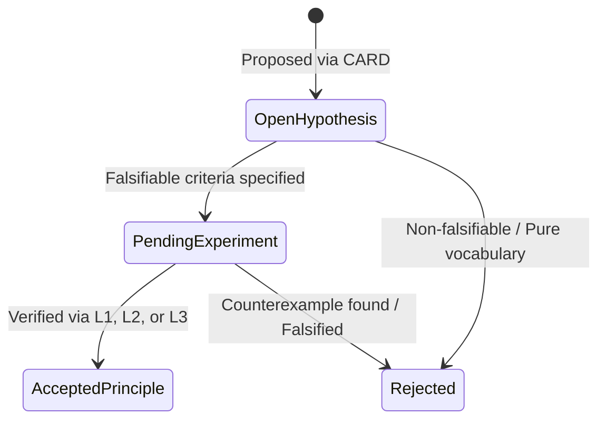

# CARD-017: TAKT Theory Extension Protocol

**Status:** Proposed / Under Review  
**Scope:** Governance & Theoretical Metatheory  
**Target:** `takt-theory` Research Line Evolution (ST-017 and future lines)

---

## 1. Context & Rationale

As `takt-theory` matures past ST-016 (v1.0.0 frozen baseline), additions to the theory must not be driven by intuition or conceptual accretion. Every extension must follow a strict **evidence trajectory**.

This CARD defines the **TAKT Theory Extension Protocol**, establishing the governance policy that dictates how theoretical claims, metrics, and models enter, transition within, or get rejected from `takt-theory`.

---

## 2. Core Hypothesis

> **Hypothesis (Theoretical Governance Necessity):**  
> A formal extension of TAKT Theory is valid if and only if it introduces predictive power, reduces existing theoretical uncertainty, or establishes verified cross-system invariant preservation that is absent in the current baseline.

---

## 3. Definition of a Valid Extension

An addition to `takt-theory` (new definition, metric, or model) is **INVALID** if it merely introduces vocabulary or intuitive classifications without predictive or falsifiable content.

A proposed extension is **VALID** if it fulfills at least one of the following criteria:

1. **Predictive Capability:** Predicts system trajectory (improvement, stagnation, degradation) given action $a_t$ on state $S_t$.
2. **Uncertainty Reduction:** Reduces formal or empirical entropy/uncertainty in decision-making bounds.
3. **Invariance & Transportability:** Formally proves conditions under which certificates, decisions, or representations transfer across runtimes or agents without loss of correctness.

---

## 4. Evidence Taxonomy & Hierarchy

Every claim within a proposed extension must specify its evidence level:

| Level | Type | Criterion | Required Artifact |
| :--- | :--- | :--- | :--- |
| **L1** | **Formal** | Theorem mechanically proved in Lean 4 without `sorry` | `.lean` module in `takt-formal/` |
| **L2** | **Experimental** | Empirical benchmark demonstrating hypothesis under statistical control | Execution log / benchmark suite in `experiments/` or `benchmarks/` |
| **L3** | **Operational** | Verified invariant preservation in runtime execution | Test suite / kernel integration in `cli/src/takt-core/` |

---

## 5. Theory State Machine

Concepts and extensions move strictly through 4 states:

1. **Open Hypothesis:** Formulated with clear falsification criteria and expected predictive gain.
2. **Pending Experiment:** Active research line / benchmark designed to test the hypothesis.
3. **Accepted Principle:** Verified by required evidence level (L1/L2/L3) and merged into formal theoretical core.
4. **Rejected:** Falsified by counterexample or rejected for lack of empirical/formal predictive value.

---

## 6. Definition of Done (CARD-017 Approval Gate)

1. Policy approved as normative entry criteria for `ST-017` research lines.
2. Protocol enforced before writing downstream architecture specs (e.g., `2026-07-30-st017-evolution-protocol-design.md`).
3. No direct modification of `takt-theory` structural tree without a corresponding CARD passing this protocol.
