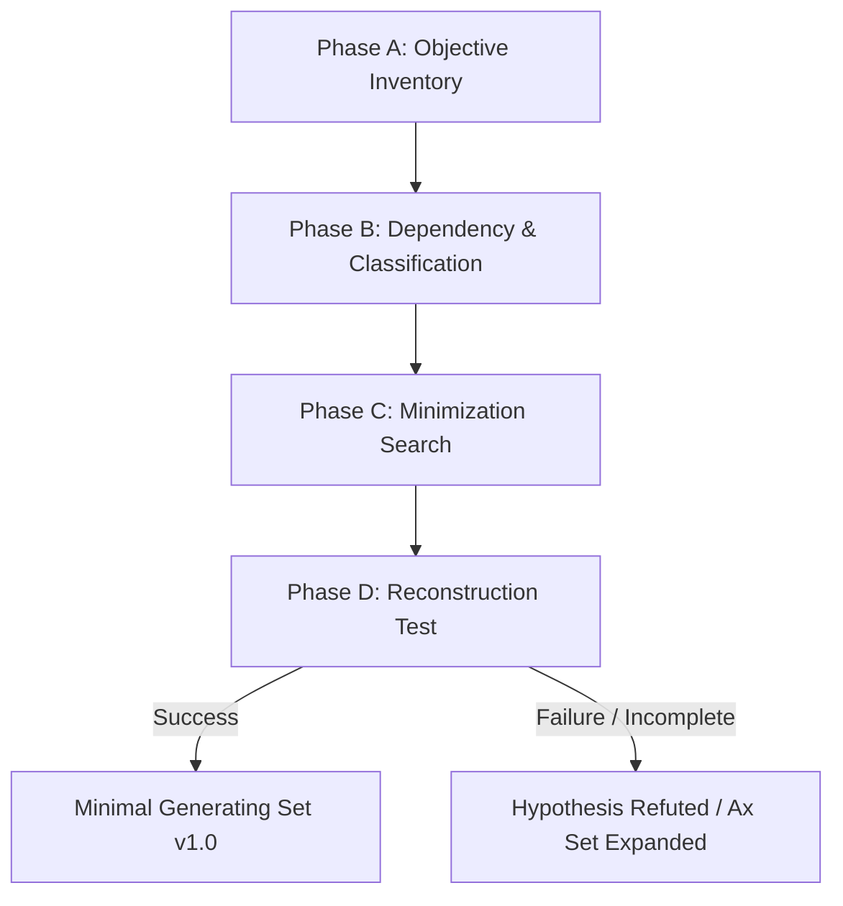

# CARD-017.1: Foundations Stabilization & Minimal Generating Set Experiment

**Status:** Proposed / Ready for Execution  
**Scope:** Layer 1 Foundations Governance  
**Parent Protocol:** [CARD-017: TAKT Theory Extension Protocol](file:///home/valentin/code/takt-theory/docs/cards/CARD-017-theory-extension-protocol.md)  
**Parent Spec:** [ST-017 Evolution Protocol Design](file:///home/valentin/code/takt-theory/docs/superpowers/specs/2026-07-30-st017-evolution-protocol-design.md)  
**Baseline Standard:** ST-016 v1.0.0 (`fca31f0` frozen baseline)

---

## 1. Core Hypothesis & Falsification Criteria

> **Hypothesis (Theoretical Minimality & Compressibility):**  
> There exists a strict Minimal Generating Set (MGS) of primitive axioms $\mathcal{A}_{\text{min}} \subset \mathcal{S}_{\text{ST-016}}$ such that $|\mathcal{A}_{\text{min}}| \ll |\mathcal{S}_{\text{ST-016}}|$, from which the entirety of ST-016 normative claims, Lean 4 theorems, and runtime kernel invariants can be logically reconstructed without loss of decision-preservation capabilities.

* **Falsification Criteria:**
  - If removing any candidate redundant node $S_i$ breaks the logical reconstruction of downstream theorems/invariants AND requires adding an independent, non-derivable assumption to repair it, then $S_i \in \mathcal{A}_{\text{min}}$.
  - If $|\mathcal{A}_{\text{min}}| \approx |\mathcal{S}_{\text{ST-016}}|$ (no significant reduction), the compressibility hypothesis is refutably rejected.

---

## 2. Falsifiable Prediction

> **Prediction (Structural Reducibility):**  
> The primitive axiom set $\mathcal{A}_{\text{min}}$ required to logically reconstruct ST-016 is a strict proper subset of the normative claim set ($\mathcal{A}_{\text{min}} \subset \mathcal{S}_{\text{ST-016}}$ and $|\mathcal{A}_{\text{min}}| < |\mathcal{S}_{\text{ST-016}}|$). The majority of baseline statements will be categorized as derived theorems, language definitions, or operational runtime assumptions rather than primitive axioms.

---

## 3. Four-Phase Experimental Design

### Phase A — Objective Claim Inventory (Pure Registration & Corpus Freeze)
- **Corpus Freeze Scope:** The inventory domain $\mathcal{S}_{\text{ST-016}}$ is strictly bounded to frozen baseline ST-016 v1.0.0 normative specification documents (`docs/superpowers/specs/2026-07-27-st016-normative-runtime-specification.md`), Lean 4 formalization modules (`takt-formal/`), and core runtime invariants (`cli/src/takt-core/`). Informal notes, commit messages, and post-ST-016 drafts are explicitly excluded.
- **Statement Identity Rule:** Two textual statements share the same Statement ID if and only if they possess identical normative or formal content. Editorial variations or restatements in different sections generate separate IDs ($S_i, S_j$) during Phase A. Potential semantic equivalence is resolved strictly downstream during Phase B to prevent premature merging.
- Registration fields must remain strictly objective without early classification or interpretation:
  - `id`: e.g. `S-001`
  - `literal_text`: Exact quote from document / code
  - `location`: File path, section, and line range
  - `type_provisional`: `UNCLASSIFIED`
  - `dependencies`: `[]`

### Phase B — Dependency Graph, Classification & Auditability
- Analyze logical dependencies and construct DAG $\mathcal{G} = (V, E)$.
- Perform explicit classification into taxonomic states (Axiom, Theorem, Definition, Operational Assumption, Open Hypothesis).
- **Disjoint Partition Invariant:** Every statement $S_i$ must belong to exactly one final taxonomic state. No statement may be assigned to multiple categories ($\text{Primitives} \cap \text{Derived} \cap \text{Definitions} \cap \text{Assumptions} \cap \text{Open} = \emptyset$).
- **Auditability & Confidence Metadata:** For each statement $S_i$, record:
  - `classification`: Target taxonomic state
  - `justification`: Explicit logical derivation step or proof reference
  - `evidence_ref`: Path to Lean 4 theorem, test file, or spec section
  - `confidence`: `CONFIRMED` (proven/verified), `TENTATIVE` (plausible derivation), or `CONTESTED` (disputed / open question)
  - `timestamp`: Execution ISO timestamp

### Phase C — Minimization Search (Ablation)
- Iteratively attempt node removal to test necessity:
  - **Essential:** Node removal breaks downstream reachability/reconstruction.
  - **Redundant:** Node removal leaves downstream reconstruction intact.

### Phase D — Complete Reconstruction Test, MGS v1.0 & Post-MGS Alignment Audit
- Formally verify that $\mathcal{A}_{\text{min}}$ derives the entire ST-016 graph.
- Publish `Minimal Generating Set (MGS) v1.0` artifact as the versioned reference for future extensions.
- **Post-MGS Alignment Audit Gate:** Before progressing to ST-017.2 (Dynamics), perform a cross-verification audit:
  1. Verify alignment between MGS primitives and Lean 4 formal declarations in `takt-formal/`.
  2. Verify alignment between MGS primitives and runtime kernel state in `cli/src/takt-core/`.
  3. Ensure no implicit unstated assumptions exist outside MGS.
- **Future Theoretical Stability Metric ($\Delta_{\text{MGS}}$ Candidate):** Note that future versions of MGS (v1.1, v2.0) will track nucleus delta $\Delta_{\text{MGS}}$ to quantify whether additions modify primitive axioms (paradigm shift) or merely introduce derived theorems/definitions (incremental growth).

---

## 4. Taxonomic Classification Output

Each statement $S_i \in \mathcal{S}_{\text{ST-016}}$ receives a strict, non-ambiguous classification in Phase B:

| Classification State | Operational Definition | Level |
| :--- | :--- | :--- |
| **Primitive Axiom** | Non-derivable assumption strictly required in $\mathcal{A}_{\text{min}}$ | L1 / L2 |
| **Derived Theorem** | Provable directly from $\mathcal{A}_{\text{min}}$ | L1 |
| **Language Definition** | Syntactic mapping / structural convention with zero empirical claim | N/A |
| **Operational Assumption** | Condition required strictly for runtime engine execution | L3 |
| **Open Hypothesis** | Claim requiring further empirical/formal evidence before inclusion | Pending |

---

## 5. Threats to Validity & Mitigation Strategies

### 5.1 Construct Validity
* **Risk:** Statement extraction granularity could bias claim count or dependency density.
* **Mitigation:** Strict enforcement of the *Statement Identity Rule* and *Corpus Freeze Scope* in Phase A; deferring all interpretation to Phase B.

### 5.2 Internal Validity
* **Risk:** A derived theorem might be misclassified as a primitive axiom due to an unpromoted or incomplete formal proof.
* **Mitigation:** Mandatory audit metadata (`justification`, `evidence_ref`) combined with explicit confidence levels (`CONFIRMED` / `TENTATIVE` / `CONTESTED`).

### 5.3 External Validity
* **Risk:** The resulting `MGS v1.0` is strictly valid for baseline ST-016 v1.0.0 and does not guarantee minimality for future domain expansions.
* **Mitigation:** Explicit versioning (`MGS v1.0`) and delta metric tracking ($\Delta_{\text{MGS}}$) for subsequent iterations.

### 5.4 Conclusion Validity
* **Risk:** Failure to reduce axiom count could reflect search procedure limits rather than fundamental theoretical non-compressibility.
* **Mitigation:** Explicit Falsification Criterion:

> **Explicit Falsification Rule:**  
> The main hypothesis is refutably rejected if and only if, upon completing Phase D, no strict proper subset of Statements $\mathcal{A}_{\text{min}} \subset \mathcal{S}_{\text{ST-016}}$ can be identified that logically reconstructs all fundamental baseline properties.

---

## 6. Definition of Done & Final Deliverables

1. Complete objective inventory dataset created in `experiments/st017-1-foundations-inventory.json` with unclassified literal quotes adhering to Corpus Freeze & Statement Identity Rules (Phase A).
2. Dependency DAG generated and classified in `experiments/st017-1-dependency-dag.json` (Phase B).
3. Ablation search completed identifying $\mathcal{A}_{\text{min}}$ (Phase C).
4. `Minimal Generating Set (MGS) v1.0` artifact published in `docs/superpowers/specs/2026-07-30-st017-1-mgs-v1.0.md` containing explicit Primitives, Derived, Definitions, and Open Hypotheses lists (Phase D).

