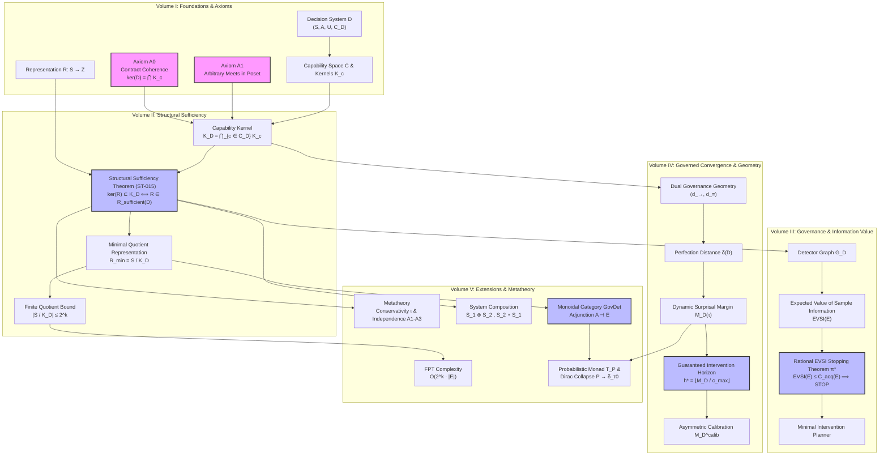

# Global Theoretical Dependency Map

This document presents the unified logical dependency architecture of TAKT across all 5 volumes, tracing the axiomatic foundation ($A0, A1$) down to minimal quotient representations, EVSI stopping rules, governance geometry, monoidal categories, and probabilistic Dirac collapse.

---

## Master Global Dependency Graph (Mermaid)

---

## Logical Layer Summary

1. **Layer 0 (Axiomatic Base):** Axioms $A0$ (Contract Coherence) and $A1$ (Arbitrary Meets) establish the formal bridge between contract requirements $C_D$ and state space equivalence relations $K_c$.
2. **Layer 1 (Core Structural Sufficiency):** Theorem **ST-015** proves that a representation $R$ preserves optimal decisions iff $\ker(R) \subseteq K_D$, constructing the canonical minimal quotient representation $R_{\text{min}} = S / K_D$ bounded by $2^k$.
3. **Layer 2 (Value of Information & Governance):** Builds detector transition graphs $\mathcal{G}_D$ and proves the Rational EVSI Stopping Theorem $\pi^*$.
4. **Layer 3 (Governed Convergence & Geometry):** Establishes metric space properties $(d_{\rightarrow}, d_{\equiv})$, perfection distance $\delta(D)$, surprisal margins $M_D$, and certified intervention horizons $h^*$.
5. **Layer 4 (Metatheory, Categories & Extensions):** Extends structural sufficiency to monoidal category theory ($\mathbf{GovDet}$), fixed-parameter tractability, system composition, and measure-theoretic probability monads ($\mathcal{T}_{\mathbb{P}}$).
