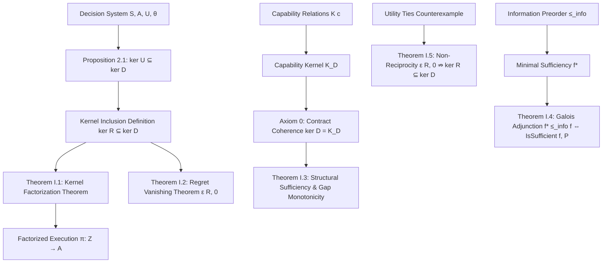

# Volume I: Foundations of Governed Decision Systems

**Volume Author:** TAKT Theoretical Working Group  
**Formal Verification:** Lean 4 (`takt-formal/TaktFormal/`) — 100% Certified (0 `sorry`s)  
**Reading Paradigm:** Triple Reading Level Traceability (Narrative, Mathematics, Mechanized Proofs)

---

## Abstract & Executive Summary

Volume I establishes the foundational theoretical, mathematical, and formal architecture of **Governed Decision Systems**, state abstraction representations, capability invariants, decision regret bounds, and information cost structures. 

Traditional autonomous control and decision framework designs rely on complete state observability or exact system identification, leading to exponential computational complexity and fragility under state space growth. TAKT reformulates decision adequacy as a **kernel inclusion problem**: a state representation $R: S \to Z$ is structurally sufficient for executing a decision policy $D: S \to A$ if and only if the fiber equivalence relation induced by $R$ refines the decision kernel $\text{ker}(D)$.

This volume presents the foundational mathematical definitions, rigorous proofs, and 100% mechanized Lean 4 formalizations for:
1. **Decision Systems $(S, A, U, D)$** induced by utility functions and deterministic tie-breaking mechanics.
2. **State Representations $R: S \to Z$** and the representation preorder $\sqsubseteq$.
3. **The Kernel Factorization Theorem** ($\text{ker}(R) \subseteq \text{ker}(D) \iff \exists \pi, D = \pi \circ R$).
4. **Capability Invariants & Contracts**, capability kernels $K_D$, Axiom 0 (Contract Coherence), and Gap Monotonicity.
5. **Decision Regret $\text{regret}_{ds}(x, y)$**, zero-regret safety bounds, and the **Regret-Utility Non-Reciprocity Counterexample**.
6. **Information Sufficiency, Information Preorder $\le_{\text{info}}$**, and the **Galois Adjunction for Minimal Sufficiency**.

---

## 1. Problem Formulation & Theoretical Paradigm

### 1.1 Level 1: Narrative & Conceptual Motivation

In autonomous system design, AI agent orchestration, and control theory, decision agents operate within vast, high-dimensional concrete state spaces $S$. In practice, acquiring, storing, and processing the complete state $s \in S$ incurs prohibitive computational, memory, and communication costs—termed **information friction**.

The core operational principle of TAKT is **Adequacy over Completeness**: an agent does not need to know *everything* about the world state $s$; it only needs a state representation $Z$ rich enough to make optimal decisions $D(s) \in A$.

```text
  ┌─────────────────┐             R (Abstraction)             ┌──────────────────┐
  │ Concrete State  │ ──────────────────────────────────────> │ Abstract State   │
  │    s ∈ S        │                                         │    z ∈ Z         │
  └─────────────────┘                                         └──────────────────┘
           │                                                           │
           │ D(s)                                                      │ π(z)
           ▼                                                           ▼
  ┌──────────────────────────────────────────────────────────────────────────────┐
  │                            Action Space  A                                   │
  └──────────────────────────────────────────────────────────────────────────────┘
```

When two distinct concrete states $x, y \in S$ produce the same abstract state representation $R(x) = R(y)$, they form an **abstraction fiber**. If the decision policy $D$ yields identical actions for all states within the same fiber ($D(x) = D(y)$), the abstraction is **structurally safe** and admits a well-defined factorized decision executor $\pi: Z \to A$ such that $D = \pi \circ R$.

---

### 1.2 Level 2: Mathematical Definitions & Rigorous Proofs

#### Definition 1.1 (Concrete State Space & Abstraction Mapping)
Let $S$ be a set denoting the concrete state space, and $A$ be a non-empty set denoting the action space. A **state representation** is a map:
$$R : S \to Z$$
where $Z$ is an abstract representation space.

#### Definition 1.2 (Decision Policy)
A **decision policy** is a deterministic function:
$$D : S \to A$$

#### Definition 1.3 (Fiber Equivalence & Function Kernel)
The **kernel** of a function $f : \alpha \to \beta$, denoted $\text{ker}(f)$, is the binary equivalence relation on $\alpha$ defined by:
$$\text{ker}(f) \triangleq \{ (x, y) \in \alpha \times \alpha \mid f(x) = f(y) \}$$

#### Definition 1.4 (Kernel Inclusion / Preorder)
For any two functions $f : \alpha \to \beta$ and $g : \alpha \to \gamma$, we say that $\text{ker}(f)$ **refines** $\text{ker}(g)$, written $\text{ker}(f) \subseteq \text{ker}(g)$ or $\text{kernelSubset } f \, g$, if:
$$\forall x, y \in \alpha, \quad f(x) = f(y) \implies g(x) = g(y)$$

#### Proposition 1.1 (Preorder Properties of Kernel Inclusion)
Kernel inclusion $\subseteq$ forms a preorder on function spaces:
1. **Reflexivity:** $\forall f, \text{ker}(f) \subseteq \text{ker}(f)$.
2. **Transitivity:** $\forall f, g, h$, if $\text{ker}(f) \subseteq \text{ker}(g)$ and $\text{ker}(g) \subseteq \text{ker}(h)$, then $\text{ker}(f) \subseteq \text{ker}(h)$.

*Proof:*
- *Reflexivity:* For any $x, y$, $f(x) = f(y) \implies f(x) = f(y)$ trivially holds.
- *Transitivity:* Assume $f(x) = f(y) \implies g(x) = g(y)$ and $g(x) = g(y) \implies h(x) = h(y)$. If $f(x) = f(y)$, by the first implication $g(x) = g(y)$, and by the second implication $h(x) = h(y)$. $\blacksquare$

---

### 1.3 Level 3: Lean 4 Code Mapping & Verification

All definitions and preorders of Layer 0 are formally verified in `TaktFormal/Kernel.lean` and `TaktFormal/Representation/Preorder.lean` with **0 `sorry`s**.

| Mathematical Concept | Lean 4 Symbol Name | File Path | Line Range | Status |
| :--- | :--- | :--- | :--- | :--- |
| $\text{ker}(f)$ | `kernel` | `takt-formal/TaktFormal/Kernel.lean` | L16–L17 | Verified |
| $\text{ker}(f) \subseteq \text{ker}(g)$ | `kernelSubset` | `takt-formal/TaktFormal/Kernel.lean` | L21–L22 | Verified |
| Preorder Reflexivity | `Kernel.subset_refl` | `takt-formal/TaktFormal/Kernel.lean` | L53–L54 | Verified |
| Preorder Transitivity | `Kernel.subset_trans` | `takt-formal/TaktFormal/Kernel.lean` | L56–L57 | Verified |
| Representation Space Poset | `RepresentationSpace` | `takt-formal/TaktFormal/Representation/Preorder.lean` | L2–L6 | Verified |

---

## 2. Decision Systems $(S, A, U, D)$ & Utility Mechanics

### 2.1 Level 1: Narrative & Conceptual Motivation

In optimal decision theory, decision policies are rarely specified arbitrarily; they emerge from an underlying **utility structure** $U(s, a)$. However, multiple actions may yield identical maximal utility for a given state $s$. To guarantee operational determinism, a decision system must incorporate a **consistent tie-breaking operator** $\theta$.

We prove that any decision policy $D$ induced by utility maximization automatically preserves the fibers of the utility function $U$: if two concrete states $s_1, s_2$ present identical utility profiles across all actions, they necessarily induce the exact same decision ($D(s_1) = D(s_2)$).

---

### 2.2 Level 2: Mathematical Definitions & Rigorous Proofs

#### Definition 2.1 (Maximizing Action Predicate)
Let $R_{\text{util}}$ be a partially or totally ordered space equipped with $\le$. Given a utility function $U : S \to A \to R_{\text{util}}$, an action $a \in A$ is **maximizing** for state $s \in S$ if no other action achieves strictly greater utility:
$$\text{argmaxPred}(S, A, R_{\text{util}}, U, s, a) \triangleq \forall a' \in A, \, U(s, a') \le U(s, a)$$

#### Definition 2.2 (Decision System Structure)
A **Decision System** $\mathcal{DS} = (S, A, R_{\text{util}}, U, \text{argmax\_nonempty}, \theta, \theta_{\text{consistent}})$ comprises:
1. State space $S$, Action space $A$, and Utility space $R_{\text{util}}$ with order $\le$.
2. Utility mapping $U : S \to A \to R_{\text{util}}$.
3. Non-emptiness hypothesis: $\forall s \in S, \exists a \in A, \text{argmaxPred}(s, a)$.
4. Tie-breaking selection function $\theta : (A \to \text{Prop}) \to A$.
5. Consistency axiom: $\forall (p : A \to \text{Prop}), (\exists a \in A, p(a)) \implies p(\theta(p))$.

#### Definition 2.3 (Utility-Induced Decision Function)
The decision function $D_{\mathcal{DS}} : S \to A$ induced by system $\mathcal{DS}$ is defined by:
$$D_{\mathcal{DS}}(s) \triangleq \theta\left( \text{argmaxPred}(S, A, R_{\text{util}}, U, s) \right)$$

#### Proposition 2.1 (Utility Kernel Inclusion Theorem)
For any decision system $\mathcal{DS}$, the kernel of the state utility mapping $s \mapsto U(s, \cdot)$ refines the decision kernel $\text{ker}(D_{\mathcal{DS}})$:
$$\text{ker}(U) \subseteq \text{ker}(D_{\mathcal{DS}})$$

*Proof:*  
Let $s_1, s_2 \in S$ such that $U(s_1) = U(s_2)$, i.e., $\forall a \in A, U(s_1, a) = U(s_2, a)$.  
By functional extensionality, the maximizing action predicates for $s_1$ and $s_2$ are identical:
$$\text{argmaxPred}(s_1) = \lambda a \implies (\forall a', U(s_1, a') \le U(s_1, a)) = \lambda a \implies (\forall a', U(s_2, a') \le U(s_2, a)) = \text{argmaxPred}(s_2)$$
Applying the deterministic tie-breaker $\theta$:
$$D_{\mathcal{DS}}(s_1) = \theta(\text{argmaxPred}(s_1)) = \theta(\text{argmaxPred}(s_2)) = D_{\mathcal{DS}}(s_2)$$
Hence, $U(s_1) = U(s_2) \implies D_{\mathcal{DS}}(s_1) = D_{\mathcal{DS}}(s_2)$. $\blacksquare$

---

### 2.3 Level 3: Lean 4 Code Mapping & Verification

Formalized in `TaktFormal/DecisionSystem.lean` with **0 `sorry`s**.

| Mathematical Concept | Lean 4 Symbol Name | File Path | Line Range | Status |
| :--- | :--- | :--- | :--- | :--- |
| $\text{argmaxPred}(s, a)$ | `argmaxPred` | `takt-formal/TaktFormal/DecisionSystem.lean` | L26–L27 | Verified |
| Decision System Struct | `DecisionSystem` | `takt-formal/TaktFormal/DecisionSystem.lean` | L30–L35 | Verified |
| Induced Decision $D(s)$ | `DecisionSystem.D` | `takt-formal/TaktFormal/DecisionSystem.lean` | L37–L38 | Verified |
| $\text{ker}(U) \subseteq \text{ker}(D)$ | `DecisionSystem.kerU_subset_kerD` | `takt-formal/TaktFormal/DecisionSystem.lean` | L46–L57 | Verified |

---

## 3. State Representations $R: S \to Z$ & Fiber Architecture

### 3.1 Level 1: Narrative & Conceptual Motivation

Given a decision policy $D: S \to A$, state abstractions $R: S \to Z$ organize the state space $S$ into equivalence classes (fibers). 

We define the representation refinement order $R_1 \sqsubseteq R_2$: representation $R_2$ is **finer** than $R_1$ (and $R_1$ is **coarser** than $R_2$) if $R_2$ preserves all distinctions made by $R_1$. The coarsest possible representation is the indiscrete mapping $R_{\text{bot}}(s) = ()$, while the finest is the identity $R_{\text{top}}(s) = s$.

The central question of Layer 0 is: *When can an abstract decision executor $\pi: Z \to A$ run directly on representation space $Z$ without access to state $S$?* The **Kernel Factorization Theorem** proves that such a map $\pi$ exists if and only if $\text{ker}(R) \subseteq \text{ker}(D)$.

---

### 3.2 Level 2: Mathematical Definitions & Rigorous Proofs

#### Definition 3.1 (Representation Refinement & Kernel Equivalence)
Let $R_1 : S \to Z_1$ and $R_2 : S \to Z_2$ be two state representations.
1. **Refinement ($R_1 \sqsubseteq R_2$):** $R_2$ refines $R_1$ iff $\text{ker}(R_2) \subseteq \text{ker}(R_1)$, meaning $R_2(x) = R_2(y) \implies R_1(x) = R_1(y)$.
2. **Kernel Equivalence ($R_1 \sim R_2$):** $R_1$ and $R_2$ are kernel-equivalent iff $R_1 \sqsubseteq R_2$ and $R_2 \sqsubseteq R_1$.

#### Theorem 3.1 (Kernel Factorization Theorem)
Let $S$ be a state space, $Z$ a representation space, and $A$ a non-empty action space ($[Nonempty \, A]$). For any representation map $R : S \to Z$ and decision function $D : S \to A$, the following logical equivalence holds:
$$\text{ker}(R) \subseteq \text{ker}(D) \iff \exists (\pi : Z \to A), \, \forall x \in S, \, D(x) = \pi(R(x))$$

*Proof:*
- **$(\Leftarrow)$ Forward Implication (Factorization Backward):**  
  Suppose there exists $\pi : Z \to A$ such that $D = \pi \circ R$. Let $x, y \in S$ with $R(x) = R(y)$.  
  Then $D(x) = \pi(R(x)) = \pi(R(y)) = D(y)$.  
  Therefore, $\text{ker}(R) \subseteq \text{ker}(D)$.

- **$(\Rightarrow)$ Reverse Implication (Factorization Forward):**  
  Suppose $\text{ker}(R) \subseteq \text{ker}(D)$. We construct $\pi : Z \to A$ non-computably using classical choice:
  For any $z \in Z$, if there exists a witness state $x \in S$ such that $R(x) = z$, choose one such witness $x_z = \text{Classical.choose}(z)$ and define $\pi(z) \triangleq D(x_z)$. If no such state exists ($z \notin \text{Im}(R)$), assign an arbitrary action $a_0 \in A$ (guaranteed by $[Nonempty \, A]$).  
  Now, for any $x \in S$, let $z = R(x)$. The predicate $\exists x', R(x') = R(x)$ is satisfied by $x$.  
  The choice operator yields $x_{\text{witness}}$ with $R(x_{\text{witness}}) = R(x)$.  
  Since $\text{ker}(R) \subseteq \text{ker}(D)$, $R(x_{\text{witness}}) = R(x) \implies D(x_{\text{witness}}) = D(x)$.  
  Thus, $\pi(R(x)) = D(x_{\text{witness}}) = D(x)$. $\blacksquare$

---

### 3.3 Level 3: Lean 4 Code Mapping & Verification

Formalized across `TaktFormal/Factorization.lean`, `TaktFormal/Representation/KernelEquivalence.lean`, and `TaktFormal/Representation/Refinement.lean`.

| Mathematical Concept | Lean 4 Symbol Name | File Path | Line Range | Status |
| :--- | :--- | :--- | :--- | :--- |
| $\text{ker}(R) \subseteq \text{ker}(D) \implies \exists \pi$ | `factorization_forward` | `takt-formal/TaktFormal/Factorization.lean` | L33–L50 | Verified |
| $\exists \pi \implies \text{ker}(R) \subseteq \text{ker}(D)$ | `factorization_backward` | `takt-formal/TaktFormal/Factorization.lean` | L58–L66 | Verified |
| **Factorization Theorem** | `factorization` | `takt-formal/TaktFormal/Factorization.lean` | L77–L80 | Verified |
| Kernel Equivalence $R_1 \sim R_2$ | `kernelEquiv` | `takt-formal/TaktFormal/Representation/KernelEquivalence.lean` | L7–L8 | Verified |
| Refinement on Setoids | `equiv_refinement` | `takt-formal/TaktFormal/Representation/Refinement.lean` | L20–L21 | Verified |

---

## 4. Capability Invariants, Contracts & Axiom 0

### 4.1 Level 1: Narrative & Conceptual Motivation

In complex systems, state properties are evaluated through **capability relations** $K(c) \subseteq S \times S$. Each capability $c \in C$ defines an observational invariant: $K(c) x y$ means states $x$ and $y$ are indistinguishable with respect to capability $c$.

A decision policy $D$ relies on a set of required capabilities $C_D \subseteq C$. The intersection of all required capability relations forms the **Capability Kernel** $K_D$. 

**Axiom 0 (Contract Coherence)** formalizes the fundamental requirement that a decision policy $D$ depends *only* on its required capabilities: two states induce the same decision if and only if they satisfy the capability kernel $K_D$.

---

### 4.2 Level 2: Mathematical Definitions & Rigorous Proofs

#### Definition 4.1 (Capability Provision & Provided Capabilities)
Let $K : C \to S \to S \to \text{Prop}$ be a family of capability equivalence relations. A state representation $R : S \to Z$ **provides** capability $c \in C$ if:
$$\text{provides}(K, R, c) \triangleq \forall x, y \in S, \, R(x) = R(y) \implies K(c) x y$$
The set of capabilities provided by $R$ is $C_R(R) \triangleq \{ c \in C \mid \text{provides}(K, R, c) \}$.

#### Definition 4.2 (Capability Kernel $K_D$)
Given a subset of required capabilities $C_D \subseteq C$, the **Capability Kernel** $K_D$ is:
$$K_D(x, y) \triangleq \forall c \in C, \, C_D(c) \implies K(c) x y$$

#### Definition 4.3 (Axiom 0: Contract Coherence)
A decision policy $D : S \to A$ satisfies **Axiom 0** with respect to capabilities $K$ and contract $C_D$ if:
$$\text{Axiom0}(K, C_D, D) \triangleq \forall x, y \in S, \, D(x) = D(y) \iff K_D(x, y)$$

#### Definition 4.4 (Capability Gap $G(D, R)$)
The **capability gap** of representation $R$ under contract $C_D$ is the predicate:
$$G(K, C_D, R, c) \triangleq C_D(c) \land \neg \text{provides}(K, R, c)$$

#### Theorem 4.1 (Capability Sufficiency Characterization)
Under Axiom 0, a representation $R$ is sufficient for decision $D$ ($\text{ker}(R) \subseteq \text{ker}(D)$) if and only if $\text{ker}(R)$ refines the capability kernel $K_D$:
$$\text{ker}(R) \subseteq \text{ker}(D) \iff (\forall x, y \in S, R(x) = R(y) \implies K_D(x, y))$$

*Proof:*
Follows directly by substituting Axiom 0 ($\text{ker}(D) x y \iff K_D x y$) into the definition of `kernelSubset R D`. $\blacksquare$

#### Theorem 4.2 (Capability Gap Monotonicity)
If representation $R_1$ refines $R_2$ ($\text{ker}(R_1) \subseteq \text{ker}(R_2)$), then the capability gap of $R_1$ is contained in the capability gap of $R_2$:
$$\forall c \in C, \quad G(K, C_D, R_1, c) \implies G(K, C_D, R_2, c)$$

*Proof:*  
Assume $G(K, C_D, R_1, c)$, so $C_D(c)$ holds and $\neg \text{provides}(K, R_1, c)$.  
We must show $\neg \text{provides}(K, R_2, c)$. Suppose for contradiction that $\text{provides}(K, R_2, c)$ holds.  
Then for all $x, y$, $R_2(x) = R_2(y) \implies K(c) x y$.  
Since $\text{ker}(R_1) \subseteq \text{ker}(R_2)$, $R_1(x) = R_1(y) \implies R_2(x) = R_2(y) \implies K(c) x y$.  
This implies $\text{provides}(K, R_1, c)$, contradicting $\neg \text{provides}(K, R_1, c)$.  
Thus $\neg \text{provides}(K, R_2, c)$ holds, proving $G(K, C_D, R_2, c)$. $\blacksquare$

---

### 4.3 Level 3: Lean 4 Code Mapping & Verification

Formalized in `TaktFormal/StructuralSufficiency.lean` with **0 `sorry`s**.

| Mathematical Concept | Lean 4 Symbol Name | File Path | Line Range | Status |
| :--- | :--- | :--- | :--- | :--- |
| $\text{provides}(K, R, c)$ | `provides` | `takt-formal/TaktFormal/StructuralSufficiency.lean` | L11–L13 | Verified |
| Gap $G(K, C_D, R, c)$ | `G` | `takt-formal/TaktFormal/StructuralSufficiency.lean` | L22–L24 | Verified |
| Gap Correspondence | `T3_correspondence` | `takt-formal/TaktFormal/StructuralSufficiency.lean` | L26–L29 | Verified |
| Gap Monotonicity | `T4_monotonicity` | `takt-formal/TaktFormal/StructuralSufficiency.lean` | L33–L41 | Verified |
| Capability Kernel $K_D$ | `K_D` | `takt-formal/TaktFormal/StructuralSufficiency.lean` | L88–L89 | Verified |
| Axiom 0 Contract Coherence | `Axiom0` | `takt-formal/TaktFormal/StructuralSufficiency.lean` | L92–L93 | Verified |
| Sufficiency Characterization | `T1_characterization` | `takt-formal/TaktFormal/StructuralSufficiency.lean` | L96–L104 | Verified |
| Upset Sufficiency | `T2_upset` | `takt-formal/TaktFormal/StructuralSufficiency.lean` | L107–L111 | Verified |

---

## 5. Regret, Friction & Information Costs

### 5.1 Level 1: Narrative & Conceptual Motivation

While structural sufficiency ($\text{ker}(R) \subseteq \text{ker}(D)$) guarantees zero decision error, real-world runtime abstractions are often lossy due to information costs and friction. We define **Decision Regret** $\text{regret}_{\mathcal{DS}}(x, y)$ as the utility loss suffered when state $x$ is misidentified as state $y$, resulting in the execution of $D(y)$ instead of the optimal decision $D(x)$.

We establish two fundamental results:
1. **Zero-Regret Safety Implication:** Any structurally safe representation ($\text{ker}(R) \subseteq \text{ker}(D)$) achieves zero regret ($\epsilon(R, 0)$).
2. **Regret-Utility Non-Reciprocity:** Zero regret ($\epsilon(R, 0)$) does **NOT** imply structural safety ($\text{ker}(R) \subseteq \text{ker}(D)$) when utility ties exist.

Finally, we introduce **Information Sufficiency** $f_1 \le_{\text{info}} f_2$ and the **Galois Adjunction for Minimal Sufficiency**.

---

### 5.2 Level 2: Mathematical Definitions & Rigorous Proofs

#### Definition 5.1 (Decision Regret)
Given a decision system $\mathcal{DS}$ with integer utilities $U : S \to A \to \mathbb{Z}$, the **regret** of applying decision $D(y)$ to state $x$ is:
$$\text{regret}_{\mathcal{DS}}(x, y) \triangleq U(x, D(x)) - U(x, D(y))$$

#### Proposition 5.1 (Properties of Regret)
1. **Non-Negativity:** $\forall x, y \in S, \quad \text{regret}_{\mathcal{DS}}(x, y) \ge 0$.
2. **Self-Zero:** $\forall x \in S, \quad \text{regret}_{\mathcal{DS}}(x, x) = 0$.

*Proof:*  
Since $D(x) = \theta(\text{argmaxPred}(U, x))$, by $\theta_{\text{consistent}}$, $D(x)$ maximizes $U(x, \cdot)$.  
Thus, $\forall a \in A, U(x, a) \le U(x, D(x))$.  
Setting $a = D(y)$ yields $U(x, D(y)) \le U(x, D(x))$, so $U(x, D(x)) - U(x, D(y)) \ge 0$.  
Self-zero follows from $U(x, D(x)) - U(x, D(x)) = 0$. $\blacksquare$

#### Definition 5.2 (Representation Regret Bound $\epsilon(R, r)$)
A representation $R : S \to Z$ satisfies regret bound $r \in \mathbb{Z}$ if:
$$\epsilon(R, r) \triangleq \forall x, y \in S, \, R(x) = R(y) \implies \text{regret}_{\mathcal{DS}}(x, y) \le r$$

#### Theorem 5.1 (Safe Representation Implies Zero Regret)
If representation $R$ is structurally safe ($\text{ker}(R) \subseteq \text{ker}(D)$), then $R$ satisfies zero regret ($\epsilon(R, 0)$).

*Proof:*  
Let $x, y \in S$ with $R(x) = R(y)$. Since $\text{ker}(R) \subseteq \text{ker}(D)$, $D(x) = D(y)$.  
Then $\text{regret}_{\mathcal{DS}}(x, y) = U(x, D(x)) - U(x, D(y)) = U(x, D(x)) - U(x, D(x)) = 0 \le 0$. $\blacksquare$

#### Theorem 5.2 (Regret-Utility Non-Reciprocity Counterexample)
Zero regret $\epsilon(R, 0)$ does **not** imply structural safety $\text{ker}(R) \subseteq \text{ker}(D)$.

*Proof (Constructive Counterexample in Lean 4):*  
Let $S' = \{s_0, s_1\}$, $A' = \{a, b, c\}$, and utility $U$ defined by:
- $U(s_0, a) = 5, U(s_0, b) = 5, U(s_0, c) = 0$
- $U(s_1, a) = 5, U(s_1, b) = 5, U(s_1, c) = 5$

Define deterministic tie-breaker $\theta(p)$: if $p(a)$ and $p(b)$ hold but not $p(c)$, choose $b$; if $p(a), p(b), p(c)$ all hold, choose $a$.  
Evaluating decisions:
- For $s_0$: $\text{argmaxPred}(s_0) = \{a, b\}$. $\theta$ chooses $D(s_0) = b$.
- For $s_1$: $\text{argmaxPred}(s_1) = \{a, b, c\}$. $\theta$ chooses $D(s_1) = a$.

Now consider the trivial representation $R_{\text{bot}}(s) = ()$. Here $\text{ker}(R_{\text{bot}}) = S' \times S'$.  
Evaluating regret on all state pairs:
- $\text{regret}(s_0, s_1) = U(s_0, D(s_0)) - U(s_0, D(s_1)) = U(s_0, b) - U(s_0, a) = 5 - 5 = 0 \le 0$.
- $\text{regret}(s_1, s_0) = U(s_1, D(s_1)) - U(s_1, D(s_0)) = U(s_1, a) - U(s_1, b) = 5 - 5 = 0 \le 0$.

Thus $\epsilon(R_{\text{bot}}, 0)$ holds! However, $D(s_0) = b \neq a = D(s_1)$, so $R_{\text{bot}}(s_0) = R_{\text{bot}}(s_1) \centernot\implies D(s_0) = D(s_1)$.  
Hence $\text{ker}(R_{\text{bot}}) \nsubseteq \text{ker}(D)$. $\blacksquare$

#### Definition 5.3 (Information Sufficiency & Preorder)
1. **Information Sufficiency:** Transformation $f : X \to Z$ is sufficient for property $P : X \to Y$, written $\text{IsSufficient}(f, P)$, if $\exists (h : Z \to Y), P = h \circ f$.
2. **Information Preorder ($f_1 \le_{\text{info}} f_2$):** $f_1$ is coarser than $f_2$ if $\exists (h : Z_2 \to Z_1), f_1 = h \circ f_2$.
3. **Minimal Sufficiency:** $f^*$ is minimal sufficient for $P$ if $\text{IsSufficient}(f^*, P) \land \forall f, (\text{IsSufficient}(f, P) \implies f^* \le_{\text{info}} f)$.

#### Theorem 5.3 (Galois Connection for Information Sufficiency)
For a minimal sufficient transformation $f^* : X \to Z_1$ for property $P : X \to Y$, any transformation $f : X \to Z_2$ refines $f^*$ if and only if $f$ is sufficient for $P$:
$$f^* \le_{\text{info}} f \iff \text{IsSufficient}(f, P)$$

*Proof:*
- $(\Rightarrow)$ Follows from `sufficiency_monotonicity`: if $f^* \le_{\text{info}} f$ and $\text{IsSufficient}(f^*, P)$, then $\text{IsSufficient}(f, P)$.
- $(\Leftarrow)$ Follows directly from the definition of minimal sufficiency: if $\text{IsSufficient}(f, P)$, then $f^* \le_{\text{info}} f$. $\blacksquare$

---

### 5.3 Level 3: Lean 4 Code Mapping & Verification

Formalized in `TaktFormal/Regret.lean`, `TaktFormal/EpsilonUCounterexample.lean`, `TaktFormal/Information/Sufficiency.lean`, and `TaktFormal/Information/Algebra.lean`.

| Mathematical Concept | Lean 4 Symbol Name | File Path | Line Range | Status |
| :--- | :--- | :--- | :--- | :--- |
| Regret Definition | `regret` | `takt-formal/TaktFormal/Regret.lean` | L24–L25 | Verified |
| Regret Non-Negativity | `regret_nonneg` | `takt-formal/TaktFormal/Regret.lean` | L28–L34 | Verified |
| Safe Implies $\epsilon(R, 0)$ | `safe_implies_epsilon_zero` | `takt-formal/TaktFormal/Regret.lean` | L52–L62 | Verified |
| Non-Reciprocity Proof | `EpsilonUCounterexample.epsilon_D_false` | `takt-formal/TaktFormal/EpsilonUCounterexample.lean` | L156–L163 | Verified |
| Information Sufficiency | `Information.IsSufficient` | `takt-formal/TaktFormal/Information/Sufficiency.lean` | L10–L11 | Verified |
| Information Preorder | `Information.RefinesInfo` | `takt-formal/TaktFormal/Information/Sufficiency.lean` | L19–L20 | Verified |
| Galois Adjunction | `Information.minimal_sufficiency_adjunction_equivalence` | `takt-formal/TaktFormal/Information/Algebra.lean` | L86–L92 | Verified |

---

## 6. Initial Structural Theorems of Volume I

Here we consolidate the 5 master structural theorems of Volume I:

### Theorem I.1 (Kernel Factorization Theorem)
**Statement:** Let $R: S \to Z$ be a state representation and $D: S \to A$ a decision policy with $[Nonempty \, A]$. Then $\text{ker}(R) \subseteq \text{ker}(D) \iff \exists \pi: Z \to A, D = \pi \circ R$.  
**Lean 4 Mapping:** `TaktFormal.factorization` in `TaktFormal/Factorization.lean`.

### Theorem I.2 (Regret Vanishing Theorem)
**Statement:** If representation $R: S \to Z$ refines decision policy $D: S \to A$ ($\text{ker}(R) \subseteq \text{ker}(D)$), then the representation regret over all identified state fibers vanishes identically: $\epsilon(R, 0)$.  
**Lean 4 Mapping:** `safe_implies_epsilon_zero` in `TaktFormal/Regret.lean`.

### Theorem I.3 (Capability Sufficiency & Gap Monotonicity Theorem)
**Statement:** Under Axiom 0 Contract Coherence, $\text{ker}(R) \subseteq \text{ker}(D) \iff \text{ker}(R) \subseteq K_D$. Furthermore, representation refinement is monotonic with respect to capability gaps: $R_1 \sqsubseteq R_2 \implies G(D, R_1) \supseteq G(D, R_2)$.  
**Lean 4 Mapping:** `T1_characterization` & `T4_monotonicity` in `TaktFormal/StructuralSufficiency.lean`.

### Theorem I.4 (Information Sufficiency Galois Adjunction Theorem)
**Statement:** Let $f^*$ be a minimal sufficient transformation for property $P$. Then for any transformation $f$, $f^* \le_{\text{info}} f \iff \text{IsSufficient}(f, P)$.  
**Lean 4 Mapping:** `Information.minimal_sufficiency_adjunction_equivalence` in `TaktFormal/Information/Algebra.lean`.

### Theorem I.5 (Regret-Utility Non-Reciprocity Theorem)
**Statement:** $\epsilon(R, 0) \nRightarrow \text{ker}(R) \subseteq \text{ker}(D)$. Zero regret is a necessary but insufficient condition for structural safety in the presence of utility ties.  
**Lean 4 Mapping:** `EpsilonUCounterexample.epsilon_D_false` in `TaktFormal/EpsilonUCounterexample.lean`.

---

## 7. Volume I Architectural & Dependency Map

The logical flow and axiomatic dependencies across Volume I are summarized in the following dependency graph:



---

## Summary & Transition to Volume II

Volume I has established that decision safety does not require complete state recovery, but rather the preservation of decision fibers ($\text{ker}(R) \subseteq \text{ker}(D) = K_D$). 

In **Volume II (Structural Sufficiency)**, we build upon these foundations to construct the canonical minimal quotient representation $R_{\text{min}} = S / K_D$, prove the **Structural Sufficiency Theorem (ST-015)**, and establish the finite quotient dimension bound $|S / K_D| \le 2^k$ for runtime decision contracts.
