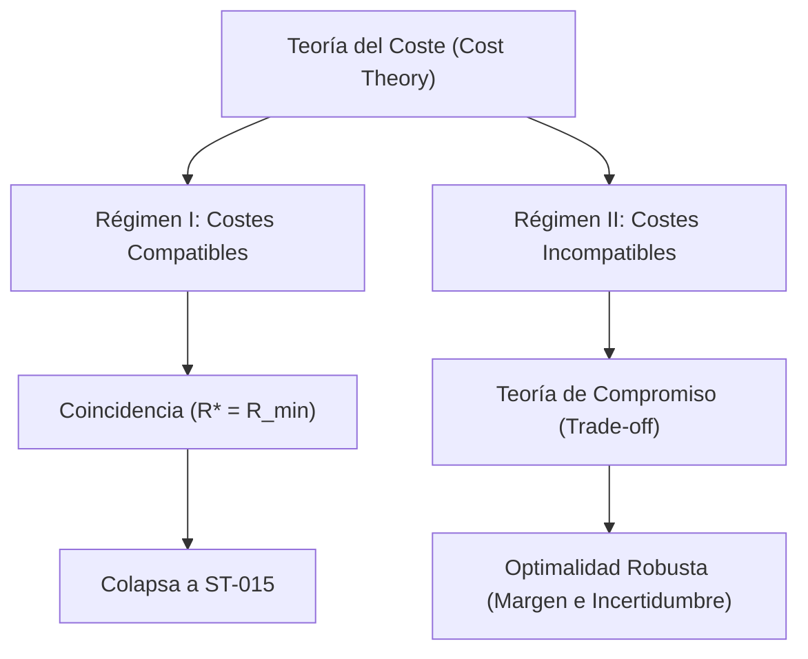

# Optimal Representation Theory (Fase IV)

> **Versión:** 0.2 (Fase de Investigación Abierta)
> **Estado:** Estructurado según estado epistemológico (Establecido, Condicionado, Abierto)

---

## Status Legend

| Status | Meaning |
| :--- | :--- |
| **Definition** | Established terminology and concepts. |
| **Working Hypothesis** | Hypothesis assumed for the current level of investigation. |
| **Open Problem** | A mathematical question with no known proof yet. |
| **Conditional Theorem** | A theorem that is valid assuming unresolved results (e.g., existence). |
| **Research Question** | An open inquiry that may alter the architecture of the theory. |
| **Possible Proof Outcome** | A potential endpoint or classification of research paths for a proof attempt. |
| **Example** | An illustrative instance. |

---

## Part I — Established Framework

### 1. Context and Motivation

Habiendo certificado y congelado el núcleo fundacional de la suficiencia en [docs/dependency-map.md](file:///home/valentin/code/takt-theory/docs/dependency-map.md), sabemos que para toda decisión $D$ con contrato coherente ($A0$) existe un conjunto bien definido de representaciones aceptables:

$$
\mathcal{R}_{\text{sufficient}}(D) = \{ R : \ker(R) \subseteq K_D \}
$$

Este conjunto es un upset en el retículo de equivalencias y tiene un elemento mínimo único $R_{\text{min}}$ (la representación cociente $S / K_D$) tal que $\ker(R_{\text{min}}) = K_D$.

El objetivo de la **Fase IV (Optimal Representation)** no es encontrar una representación que preserve la decisión (pues ya conocemos la frontera de suficiencia), sino resolver la pregunta:
> **De todas las representaciones suficientes, ¿cuál de ellas es preferible bajo un criterio de coste abstractamente modelado?**

El problema se formula como una optimización restringida en el poset $(\mathcal{R}, \sqsubseteq)$:

$$
R^* = \arg\min_{R \in \mathcal{R}_{\text{sufficient}}(D)} c(R)
$$

donde $c$ es una función de coste abstracta.

---

### 2. Cost Theory

Para mantener la generalidad teórica, evitamos asociar el coste inmediatamente a métricas físicas (como memoria o latencia). Axiomatizamos la función de coste $c$ sobre el poset de costes $(L, \sqsubseteq_L)$.

**Definition 2.1 (Cost Function).** Definimos una **función de coste** como una función:

$$
c: \mathcal{R}_{\text{sufficient}}(D) \to L
$$

donde $(L, \sqsubseteq_L)$ es un poset. En la mayoría de las instancias, $(L, \sqsubseteq_L)$ será $(\mathbb{R}_{\geq 0}, \leq)$.

**Working Hypothesis 2.2 (C0 - Cost Monotonicity).** Si $R_1 \sqsubseteq R_2$ ($R_1$ es más gruesa, es decir, hace menos distinciones y tiene mayor núcleo), entonces:

$$
c(R_1) \sqsubseteq_L c(R_2)
$$

*Intuición:* Añadir distinciones a una representación (refinarla) nunca reduce el coste; a lo sumo lo incrementa o lo mantiene igual. La representación mínima suficiente $R_{\text{min}}$ representa el coste mínimo teórico necesario para preservar la decisión de manera exacta.

**Working Hypothesis 2.3 (C0' - Strict Monotonicity).** Si $\ker(R_2) \subset \ker(R_1)$ (refinamiento estricto), entonces $c(R_1) \sqsubset_L c(R_2)$.

**Working Hypothesis 2.4 (C1 - Completeness and Existence of Meets).** El codominio de costes $(L, \sqsubseteq_L)$ admite ínfimos (meets) sobre cualquier subconjunto no vacío.

#### 2.1 Taxonomy: Intrínsecos vs Extrínsecos

Para comprender intuitivamente por qué y cuándo se rompe la monotonicidad del coste, es útil clasificar conceptualmente las funciones de coste en dos familias. Esta clasificación no es un axioma matemático rígido ni una descomposición universal obligatoria, sino un **modelo conceptual de instancia** altamente representativo para el diseño práctico:

1.  **Costes Intrínsecos ($c_{\text{intr}}$):**
    *   **Definición:** Aquellos costes que dependen únicamente de la representación $R$ en sí misma (su estructura de datos, tamaño o huella física).
    *   **Ejemplos:** Memoria de almacenamiento, tamaño en bits del código $Z$, ancho de banda de serialización, etc.
    *   **Comportamiento:** Tienden a ser **monótonos** respecto al refinamiento ($R_1 \sqsubseteq R_2 \implies c_{\text{intr}}(R_1) \leq c_{\text{intr}}(R_2)$).

2.  **Costes Extrínsecos ($c_{\text{extr}}$):**
    *   **Definición:** Aquellos costes que dependen de la interacción de la representación con el entorno o de su uso operacional.
    *   **Ejemplos:** Coste de colisión temporal en búsquedas, penalizaciones por riesgo de robustez o explicabilidad.
    *   **Comportamiento:** Tienden a ser **no monótonos** (rompen la monotonicidad).

En muchas aplicaciones prácticas, el coste se modela de forma aditiva como $c(R) = c_{\text{intr}}(R) + c_{\text{extr}}(R)$, donde la tensión entre ambas componentes da origen al trade-off de optimalidad.

#### 2.2 Classification: Dependencia de Información

Una clasificación estrictamente matemática y ortogonal a la compatibilidad con el orden se define por la **firma de información** que requiere la función de coste para ser computada. Esto nos permite estructurar las funciones de coste en tres categorías fundamentales según sus dependencias lógicas:

1.  **Costes Dependientes de la Representación: $c(R)$**
    *   **Requisito:** Solo necesitan conocer la estructura de la representación $R$ (por ejemplo, el tamaño de sus fibras o su cardinalidad $|Z|$).
    *   **Ejemplo:** $c_{\text{mem}}(R)$ o la latencia de codificación intrínseca del canal de comunicación.

2.  **Costes Dependientes de la Representación y la Decisión: $c(R, D)$**
    *   **Requisito:** Requieren conocer la estructura de $R$ en relación directa con la decisión a tomar (por ejemplo, cómo se posiciona la frontera de decisión en relación con las particiones de la representación).
    *   **Ejemplo:** Latencia operacional de la decisión factorizada o el coste de colisión relativo a la frontera de decisión (donde fusionar estados a ambos lados de la frontera causa un alto coste).

3.  **Costes Dependientes de la Representación, la Decisión y el Entorno: $c(R, D, E)$**
    *   **Requisito:** Requieren, además de la representación y la decisión, un modelo o distribución de probabilidad del entorno $E$ (por ejemplo, para evaluar la probabilidad de ruido o el impacto de un cambio en la distribución).
    *   **Ejemplo:** El riesgo operacional bajo *distribution shift* o el coste esperado ante dinámicas inciertas del entorno (donde un mayor refinamiento actúa como un margen de seguridad robusto).

#### 2.3 Realizability Matrix

Al cruzar de forma ortogonal la compatibilidad con el orden (Regímenes I y II) y la dependencia de información, obtenemos una matriz conceptual de realizabilidad. Identificamos ejemplos naturales para cada una de las celdas, demostrando que todos los cuadrantes son físicamente realizables y teóricamente significativos:

| Dependencia de Información | Compatible (Régimen I — $R_{\min}$ es óptimo) | Incompatible (Régimen II — Trade-off activo) |
| :--- | :--- | :--- |
| **$c(R)$**  *(Representación)* | **Coste de almacenamiento base:**  El número de bits requeridos para codificar $Z$. A mayor refinamiento, mayor tamaño y mayor coste. | **Coste de alineación con hardware:**  El coste de memoria física donde tamaños de código potencias de dos (16 bits) son más eficientes que no potencias de dos (17 bits). |
| **$c(R, D)$**  *(Decisión)* | **Latencia de evaluación secuencial:**  A mayor refinamiento, mayor árbol de decisión y mayor tiempo de cómputo secuencial en el runtime. | **Coste de colisión en la frontera:**  Colapsar estados a ambos lados de la frontera de decisión genera errores de clasificación (alto coste). El refinamiento reduce este coste. |
| **$c(R, D, E)$**  *(Entorno)* | **Coste de adquisición de sensores:**  Refinar la representación requiere consultar más sensores del entorno $E$, lo que incrementa el coste esperado de la telemetría. | **Riesgo de seguridad ante ruido:**  Una representación muy gruesa reduce el margen ante el ruido del entorno $E$, aumentando la probabilidad de fallos. El refinamiento mitiga este coste extrínseco. |

---

### 3. Existence of Optimal Representations

Partimos de la clausura de ST-015, lo que nos da un conjunto de representaciones suficientes $\mathcal{R}_{\text{sufficient}}(D)$ con un elemento mínimo único $R_{\min}$, y una función de coste $c: \mathcal{R}_{\text{sufficient}}(D) \to L$ donde $(L, \sqsubseteq_L)$ es un poset de costes.

**Definition 3.1 (Optimal Representation).** Sea $R \in \mathcal{R}_{\text{sufficient}}(D)$. Diremos que $R$ es óptima si:

$$
\forall R' \in \mathcal{R}_{\text{sufficient}}(D), \qquad c(R) \sqsubseteq_L c(R')
$$

*No existence is assumed.*

**Open Problem 3.2 (Pregunta D1).** ¿Qué propiedades deben satisfacer $(\mathcal{R}_{\text{sufficient}}(D), \sqsubseteq)$ y $(L, \sqsubseteq_L)$ para garantizar que exista al menos una representación óptima?

#### 3.1 Possible Proof Outcomes

Al intentar demostrar la existencia usando únicamente las hipótesis de trabajo **C0** y **C1**, identificamos tres posibles caminos o resultados:

*   **Possible Proof Outcome 3.3 (Scenario A - Success):** La demostración se completa con éxito. En este caso, **C0** y **C1** eran suficientes para garantizar la existencia.
*   **Possible Proof Outcome 3.4 (Scenario B - Failure in L):** La prueba falla debido a la falta de estructura en $(L, \sqsubseteq_L)$ (por ejemplo, porque el poset de costes no tiene elementos mínimos o ínfimos en el subconjunto de costes realizables). El problema reside en la estructura de costes.
*   **Possible Proof Outcome 3.5 (Scenario C - Failure in Domain):** La prueba falla debido a que el conjunto $\mathcal{R}_{\text{sufficient}}(D)$ es demasiado grande o complejo (por ejemplo, en dominios continuos sin compacidad o condiciones noetherianas). El problema reside en el dominio de las representaciones.

---

## Part II — Conditional Developments

> [!NOTE]
> **Working Hypothesis:** The results in this part are developed under the assumption that an Existence Theorem holds. Their purpose is to guide the research program and they should not be interpreted as established results until the existence question has been resolved.

### 4. Uniqueness

**Conditional Theorem 4.1 (Uniqueness).** Si la función de coste $c$ es estrictamente monótona respecto al refinamiento estricto (**C0'**), entonces la representación óptima $R^*$ es única salvo equivalencia de núcleos, y coincide exactamente con la representación mínima suficiente $R_{\text{min}}$.

*Demostración (Esquema).* Supongamos que existe $R' \in \mathcal{R}_{\text{sufficient}}(D)$ tal que $\ker(R') \neq \ker(R_{\text{min}})$. Como $R_{\text{min}}$ es el mínimo de las suficientes, tenemos que $\ker(R') \subset \ker(R_{\text{min}})$ estrictamente.
Por estricta monotonicidad del coste (**C0'**):
$$
c(R_{\text{min}}) \sqsubset_L c(R')
$$
Por lo tanto, ninguna representación estrictamente más fina que $R_{\text{min}}$ puede ser un mínimo de coste. Dado que el upset $\mathcal{R}_{\text{sufficient}}(D)$ está acotado por abajo por $R_{\text{min}}$, esta es la única representación que minimiza el coste. ∎

---

### 5. Coincidence and Divergence

**Conditional Theorem 5.1 (Coincidence under Monotonic Costs).** Si la función de coste $c$ es monótona respecto al refinamiento (**C0**), entonces la representación mínima suficiente es siempre un óptimo global:

$$
R_{\min} \in \arg\min_{R \in \mathcal{R}_{\text{sufficient}}(D)} c(R)
$$

Y si $c$ es estrictamente monótona (**C0'**), entonces $R_{\min}$ es el **único** óptimo global de coste:

$$
R^* = R_{\min}
$$

*Demostración.* Para toda $R \in \mathcal{R}_{\text{sufficient}}(D)$, se tiene $\ker(R) \subseteq \ker(R_{\min}) = K_D$, lo que por definición de nuestro orden de refinamiento significa que $R_{\min} \sqsubseteq R$ ($R_{\min}$ es más gruesa o igual que $R$).
1. Por el axioma de monotonicidad del coste (**C0**):
   $$
   R_{\min} \sqsubseteq R \implies c(R_{\min}) \sqsubseteq_L c(R)
   $$
   Por lo tanto, $c(R_{\min})$ es una cota inferior global del coste sobre todo el espacio de representaciones suficientes. Como $R_{\min}$ pertenece a dicho espacio, es un mínimo global.
2. Si además se cumple la monotonicidad estricta (**C0'**), para cualquier $R \neq R_{\min}$ (es decir, $R$ es estrictamente más fina, $R_{\min} \sqsubset R$), tenemos:
   $$
   c(R_{\min}) \sqsubset_L c(R)
   $$
   Lo que excluye a cualquier otra representación suficiente de ser un óptimo, garantizando la unicidad: $R^* = R_{\min}$. ∎

#### 5.1 When the optimum diverges from the minimum ($R^* \neq R_{\min}$)

Existen escenarios prácticos y teóricos muy claros en los que la función de coste $c$ **no** es monótona con respecto al refinamiento, provocando que una representación estrictamente más rica/fina sea preferible al mínimo suficiente ($R_{\min} \sqsubset R^*$).

##### A. Costes Operacionales de Colisión y Complejidad
Si una representación colapsa estados de manera muy agresiva (como lo hace $R_{\min}$ al ser el máximo colapso compatible con la decisión), puede inducir una alta probabilidad de colisiones o degradar la eficiencia de algoritmos de búsqueda o indexación posteriores en el runtime.
Si el coste total se modela como:
$$
c(R) = c_{\text{storage}}(R) + c_{\text{processing}}(R)
$$
Donde $c_{\text{storage}}$ aumenta con el refinamiento pero $c_{\text{processing}}$ disminuye (al haber menos colisiones), la función de coste total no es monótona. El óptimo $R^*$ se encontrará en un punto intermedio de compromiso (trade-off) estrictamente más fino que $R_{\min}$.

##### B. Costes de Margen y Riesgo de Seguridad (Robustez)
En sistemas sujetos a ruido o distribución shift, operar exactamente en el límite de la suficiencia teórica ($R_{\min}$) reduce a cero el margen de seguridad de la decisión.
Si definimos una función de penalización por riesgo que disminuye a medida que la representación es más rica/fina (ya que un mayor refinamiento permite verificar un margen de seguridad más amplio $\Delta > 0$ en el runtime):
$$
c_{\text{safety}}(R) = f(\text{margin}(R))
$$
donde $f$ es decreciente con el margen, entonces el óptimo de coste combinado $c(R) = c_{\text{compute}}(R) + c_{\text{safety}}(R)$ favorecerá representaciones con mayor nivel de detalle que $R_{\min}$ para actuar como un "colchón" o buffer ante la incertidumbre.

#### 5.2 Bifurcation: Regímenes I y II

El Teorema de Coincidencia y la taxonomía de costes revelan una bifurcación estructural en el programa de investigación de la Fase IV:

##### Régimen I — Costes Compatibles con el Orden
*   **Condición:** $R_1 \sqsubseteq R_2 \implies c(R_1) \sqsubseteq_L c(R_2)$. El orden de costes se alinea con el orden de refinamiento.
*   **Resultado:** La optimización colapsa a la teoría de suficiencia estructural (ST-015): la representación mínima suficiente $R_{\min}$ es automáticamente el óptimo $R^*$.
*   **Implicación:** La teoría de optimalidad en este régimen no añade nuevos grados de libertad teóricos, solo valida mecánicamente a $R_{\min}$ como la mejor opción de diseño.

##### Régimen II — Costes Incompatibles con el Orden
*   **Condición:** $\exists R_1 \sqsubseteq R_2$ tal que $c(R_2) \sqsubset_L c(R_1)$ (o son incomparables). Se rompe la compatibilidad (típicamente debido a la influencia de costes extrínsecos como colisiones o seguridad).
*   **Resultado:** Nace una tensión fundamental entre *representar menos* (reducir coste intrínseco) y *pagar menos* (reducir coste extrínseco). El óptimo $R^*$ difiere de $R_{\min}$, existiendo un trade-off computable.
*   **Implicación:** Este es el verdadero núcleo científico de la Fase IV, donde se requiere formalizar la **Teoría de Compromiso (Trade-off)** y la **Optimalidad Robusta**.

---

### 6. Composition of Optima

**Conditional Theorem 6.1 (Compositionality of Optima).** Si la función de coste es aditiva o subaditiva respecto al join de representaciones:

$$
c(R_1 \vee R_2) \sqsubseteq_L c(R_1) + c(R_2)
$$

entonces la optimalidad composicional se preserva bajo cotas superiores. Esto conecta directamente con la teoría original de composición de morfismos del Canonical Core v1.0.

---

### 7. Concrete Cost Models

**Example 7.1 (Latency Cost - $c_{\text{lat}}$).** El tiempo necesario para computar la representación a partir del estado $s$.

**Example 7.2 (Memory Cost - $c_{\text{mem}}$).** La cardinalidad del espacio de código $Z$ o el número de bits necesarios.

**Example 7.3 (Enrichment Cost - $c_{\text{enr}}$).** El coste acumulado de invocar proveedores de enriquecimiento (CARD-357/358).

**Example 7.4 (Composite Cost - $c_{\text{comp}}$).** Una combinación lineal o multiobjetivo (Pareto) de los anteriores:
$$
c(R) = w_1 c_{\text{lat}}(R) + w_2 c_{\text{mem}}(R)
$$

---

## Part III — Research Agenda

### 8. Distillation Questions

**Research Question 8.1 (Independence of Information Signature).** ¿Los teoremas de existencia y unicidad dependen únicamente de las propiedades algebraicas del orden del poset de representaciones y del poset de costes (e.g., **C0/C1** y **C0'**)? ¿O la firma informacional del coste ($c(R)$, $c(R, D)$, $c(R, D, E)$) introduce nuevas clases cualitativas de optimalidad que no pueden reducirse a relaciones de orden?
*   *Hipótesis:* Si la firma de información no altera las demostraciones abstractas, las tres categorías de dependencia son descriptivas (taxonomía para clasificar instancias) y no estructurales para los teoremas de existencia/unicidad.

**Research Question 8.2 (Realizability and Matrix Collapse).** Are all 6 cells of the realizability matrix mathematically possible, or do hidden structural restrictions make some cells impossible or redundant?
*   *Pregunta:* ¿Puede existir un coste compatible con el orden (Régimen I) que dependa del entorno $E$ de manera no trivial sin inducir colisiones o riesgos que eventualmente rompan la compatibilidad?

**Research Question 8.3 (Reduction of Regime II to Regime I).** ¿Puede el Régimen II (costes incompatibles con el orden) reducirse formalmente a una perturbación o una "métrica de distancia" sobre el Régimen I? ¿O requiere un conjunto completamente nuevo de axiomas topológicos o de retículos continuos (e.g., condiciones de Scott)?

**Research Question 8.4 (Sufficiency of Fundamental Axioms).** ¿Es la monotonicidad del coste (**C0**) y la completitud del poset de costes (**C1**) suficiente para demostrar la existencia de la representación óptima $R^*$ en cualquier caso práctico, o se requerirán axiomas de finitud (e.g., cadenas descendentes finitas / propiedades noetherianas en los kernels) al operar sobre espacios de estados infinitos?

---

## Epilogue: Methodological Principle

### Principle of Reactive Axiomatization

New axioms or assumptions are introduced only when a proof attempt fails for a demonstrable mathematical reason. 

Consequently, the evolution of the theory follows the sequence:
1. Formulate the weakest possible theorem/definitions;
2. Attempt the proof;
3. Identify the minimal obstruction;
4. Introduce only the weakest hypothesis/axiom required to remove it.
