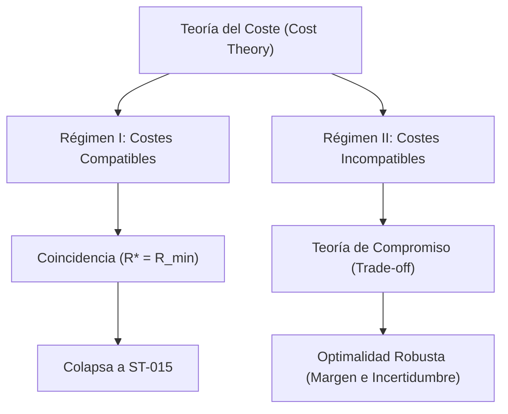

# Optimal Representation Theory (Fase IV)

> **Versión:** 0.1 (Fase de Investigación Abierta)
> **Estado:** Borrador conceptual y axiomático para la caracterización de la representación óptima.

---

## 1. Contexto y Objetivos

Habiendo certificado y congelado el núcleo fundacional de la suficiencia en [docs/dependency-map.md](file:///home/valentin/code/takt-theory/docs/dependency-map.md), sabemos que para toda decisión $D$ con contrato coherente ($A0$) existe un conjunto bien definido de representaciones aceptables:

$$
\mathcal{R}_{\text{sufficient}}(D) = \{ R : \ker(R) \subseteq K_D \}
$$

Este conjunto es un upset en el retículo de equivalencias y tiene un elemento mínimo único $R_{\text{min}}$ (la representación cociente $S / K_D$) tal que $\ker(R_{\text{min}}) = K_D$.

El objetivo de la **Fase IV (Optimal Representation)** no es encontrar una representación que preserve la decisión (pues ya conocemos la frontera de suficiencia), sino resolver la pregunta:
> **De todas las representaciones suficientes, ¿cuál de ellas es preferible bajo un criterio de coste abstractamente modelado?**

El problema se formula como una optimización restringida en el poset $(\mathcal{R}, \sqsubseteq)$:

$$
R^* = \arg\min_{R \in \mathcal{R}_{\text{sufficient}}(D)} c(R)
$$

donde $c$ es una función de coste abstracta.

---

## 2. Etapa 1 — Axiomatización del Coste

Para mantener la generalidad teórica, evitamos asociar el coste inmediatamente a métricas físicas (como memoria o latencia). Axiomatizamos la función de coste $c$ sobre el poset de costes $(L, \sqsubseteq_L)$.

### 2.1 Definición General

Definimos una **función de coste** como una función:

$$
c: \mathcal{R}_{\text{sufficient}}(D) \to L
$$

donde $(L, \sqsubseteq_L)$ es un poset. En la mayoría de las instancias, $(L, \sqsubseteq_L)$ será $(\mathbb{R}_{\geq 0}, \leq)$.

### 2.2 Propiedades Axiomáticas bajo Estudio

Identificamos los siguientes axiomas candidatos sobre la función de coste $c$ y su interacción con el orden de refinamiento $\sqsubseteq$:

1. **Monotonicidad del Coste (C0 - Cost Monotonicity):**
   Si $R_1 \sqsubseteq R_2$ ($R_1$ es más gruesa, es decir, hace menos distinciones y tiene mayor núcleo), entonces:
   $$
   c(R_1) \sqsubseteq_L c(R_2)
   $$
   *Intuición:* Añadir distinciones a una representación (refinarla) nunca reduce el coste; a lo sumo lo incrementa o lo mantiene igual. La representación mínima suficiente $R_{\text{min}}$ representa el coste mínimo teórico necesario para preservar la decisión de manera exacta.
   
2. **Estricta Monotonicidad (C0' - Strict Monotonicity):**
   Si $\ker(R_2) \subset \ker(R_1)$ (refinamiento estricto), entonces $c(R_1) \sqsubset_L c(R_2)$.
   
3. **Completitud y Existencia de Meets (C1):**
   El codominio de costes $(L, \sqsubseteq_L)$ admite ínfimos (meets) sobre cualquier subconjunto no vacío.

### 2.3 Taxonomía del Coste Conceptual: Intrínsecos vs Extrínsecos

Para comprender intuitivamente por qué y cuándo se rompe la monotonicidad del coste, es útil clasificar conceptualmente las funciones de coste en dos familias. Esta clasificación no es un axioma matemático rígido ni una descomposición universal obligatoria, sino un **modelo conceptual de instancia** altamente representativo para el diseño práctico:

1. **Costes Intrínsecos ($c_{\text{intr}}$):**
   * **Definición:** Aquellos costes que dependen únicamente de la representación $R$ en sí misma (su estructura de datos, tamaño o huella física).
   * **Ejemplos:** Memoria de almacenamiento, tamaño en bits del código $Z$, ancho de banda de serialización, etc.
   * **Comportamiento:** Tienden a ser **monótonos** respecto al refinamiento ($R_1 \sqsubseteq R_2 \implies c_{\text{intr}}(R_1) \leq c_{\text{intr}}(R_2)$).

2. **Costes Extrínsecos ($c_{\text{extr}}$):**
   * **Definición:** Aquellos costes que dependen de la interacción de la representación con el entorno o de su uso operacional.
   * **Ejemplos:** Coste de colisión temporal en búsquedas, penalizaciones por riesgo de robustez o explicabilidad.
   * **Comportamiento:** Tienden a ser **no monótonos** (rompen la monotonicidad).

En muchas aplicaciones prácticas, el coste se modela de forma aditiva como $c(R) = c_{\text{intr}}(R) + c_{\text{extr}}(R)$, donde la tensión entre ambas componentes da origen al trade-off de optimalidad.

### 2.4 Clasificación Ortogonal: Dependencia de Información

Una clasificación estrictamente matemática y ortogonal a la compatibilidad con el orden se define por la **firma de información** que requiere la función de coste para ser computada. Esto nos permite estructurar las funciones de coste en tres categorías fundamentales según sus dependencias lógicas:

1. **Costes Dependientes de la Representación: $c(R)$**
   * **Requisito:** Solo necesitan conocer la estructura de la representación $R$ (por ejemplo, el tamaño de sus fibras o su cardinalidad $|Z|$).
   * **Ejemplo:** $c_{\text{mem}}(R)$ o la latencia de codificación intrínseca del canal de comunicación.

2. **Costes Dependientes de la Representación y la Decisión: $c(R, D)$**
   * **Requisito:** Requieren conocer la estructura de $R$ en relación directa con la decisión a tomar (por ejemplo, cómo se posiciona la frontera de decisión en relación con las particiones de la representación).
   * **Ejemplo:** Latencia operacional de la decisión factorizada o el coste de colisión relativo a la frontera de decisión (donde fusionar estados a ambos lados de la frontera causa un alto coste).

3. **Costes Dependientes de la Representación, la Decisión y el Entorno: $c(R, D, E)$**
   * **Requisito:** Requieren, además de la representación y la decisión, un modelo o distribución de probabilidad del entorno $E$ (por ejemplo, para evaluar la probabilidad de ruido o el impacto de un cambio en la distribución).
   * **Ejemplo:** El riesgo operacional bajo *distribution shift* o el coste esperado ante dinámicas inciertas del entorno (donde un mayor refinamiento actúa como un margen de seguridad robusto).

---

## 3. Etapa 2 — Existencia de la Representación Óptima

### 3.1 Teorema de Existencia (Borrador)

**Teorema de Existencia.** Sea $c$ una función de coste que satisface la monotonicidad del coste (**C0**) sobre un poset de costes $(L, \sqsubseteq_L)$ que es meet-completo. Entonces, existe al menos una representación óptima $R^* \in \mathcal{R}_{\text{sufficient}}(D)$ que minimiza $c$.

*Demostración (Esquema).* Dado que $\mathcal{R}_{\text{sufficient}}(D)$ tiene a $R_{\text{min}}$ como elemento mínimo (por $T2$), para toda $R \in \mathcal{R}_{\text{sufficient}}(D)$ se tiene $R \sqsubseteq R_{\text{min}}$ (donde $\sqsubseteq$ es el orden de refinamiento en el que $R_{\text{min}}$ es la más gruesa de las suficientes).
Por la monotonicidad del coste (**C0**):
$$
R \sqsubseteq R_{\text{min}} \implies c(R) \sqsubseteq_L c(R_{\text{min}})
$$
Dado que $R_{\text{min}}$ es el elemento minimal en el orden de refinamiento de las suficientes, su coste es una cota inferior para todas las representaciones suficientes. Así, la propia $R_{\text{min}}$ (o cualquier representación equivalente en su núcleo) es un óptimo global de coste mínimo.

*Nota de investigación:* Si el coste fuera monótonamente decreciente con el refinamiento (por ejemplo, si refinar hiciera la representación más eficiente por compresión), el mínimo de coste estaría en el extremo de máxima distinción (la identidad `id`).

---

## 4. Etapa 3 — Unicidad del Óptimo

### 4.1 Teorema de Unicidad (Borrador)

**Teorema de Unicidad.** Si la función de coste $c$ es estrictamente monótona respecto al refinamiento estricto, entonces la representación óptima $R^*$ es única salvo equivalencia de núcleos, y coincide exactamente con la representación mínima suficiente $R_{\text{min}}$.

*Demostración (Esquema).* Supongamos que existe $R' \in \mathcal{R}_{\text{sufficient}}(D)$ tal que $\ker(R') \neq \ker(R_{\text{min}})$. Como $R_{\text{min}}$ es el mínimo de las suficientes, tenemos que $\ker(R') \subset \ker(R_{\text{min}})$ estrictamente.
Por estricta monotonicidad del coste:
$$
c(R_{\text{min}}) < c(R')
$$
Por lo tanto, ninguna representación estrictamente más fina que $R_{\text{min}}$ puede ser un mínimo de coste. Dado que el upset $\mathcal{R}_{\text{sufficient}}(D)$ está acotado por abajo por $R_{\text{min}}$, esta es la única representación que minimiza el coste. ∎

---

## 5. El Teorema de Coincidencia: ¿Es $R_{\min}$ siempre el óptimo $R^*$?

La relación entre la representación mínima suficiente $R_{\min}$ (la frontera de suficiencia del teorema de suficiencia estructural ST-015) y la representación óptima $R^*$ (de la teoría de optimización de la Fase IV) es el puente conceptual clave entre ambas fases.

### 5.1 Teorema de Coincidencia bajo Costes Monótonos

Si la función de coste $c$ es monótona respecto al refinamiento (**C0**), entonces la representación mínima suficiente es siempre un óptimo global:

$$
R_{\min} \in \arg\min_{R \in \mathcal{R}_{\text{sufficient}}(D)} c(R)
$$

Y si $c$ es estrictamente monótona (**C0'**), entonces $R_{\min}$ es el **único** óptimo global de coste:

$$
R^* = R_{\min}
$$

*Demostración.* Para toda $R \in \mathcal{R}_{\text{sufficient}}(D)$, se tiene $\ker(R) \subseteq \ker(R_{\min}) = K_D$, lo que por definición de nuestro orden de refinamiento significa que $R_{\min} \sqsubseteq R$ ($R_{\min}$ es más gruesa o igual que $R$).
1. Por el axioma de monotonicidad del coste (**C0**):
   $$
   R_{\min} \sqsubseteq R \implies c(R_{\min}) \leq c(R)
   $$
   Por lo tanto, $c(R_{\min})$ es una cota inferior global del coste sobre todo el espacio de representaciones suficientes. Como $R_{\min}$ pertenece a dicho espacio, es un mínimo global.
2. Si además se cumple la monotonicidad estricta (**C0'**), para cualquier $R \neq R_{\min}$ (es decir, $R$ es estrictamente más fina, $R_{\min} \sqsubset R$), tenemos:
   $$
   c(R_{\min}) < c(R)
   $$
   Lo que excluye a cualquier otra representación suficiente de ser un óptimo, garantizando la unicidad: $R^* = R_{\min}$. ∎

### 5.2 Cuando el óptimo diverge del mínimo ($R^* \neq R_{\min}$)

Existen escenarios prácticos y teóricos muy claros en los que la función de coste $c$ **no** es monótona con respecto al refinamiento, provocando que una representación estrictamente más rica/fina sea preferible al mínimo suficiente ($R_{\min} \sqsubset R^*$).

#### A. Costes Operacionales de Colisión y Complejidad
Si una representación colapsa estados de manera muy agresiva (como lo hace $R_{\min}$ al ser el máximo colapso compatible con la decisión), puede inducir una alta probabilidad de colisiones o degradar la eficiencia de algoritmos de búsqueda o indexación posteriores en el runtime.
Si el coste total se modela como:
$$
c(R) = c_{\text{storage}}(R) + c_{\text{processing}}(R)
$$
Donde $c_{\text{storage}}$ aumenta con el refinamiento pero $c_{\text{processing}}$ disminuye (al haber menos colisiones), la función de coste total no es monótona. El óptimo $R^*$ se encontrará en un punto intermedio de compromiso (trade-off) estrictamente más fino que $R_{\min}$.

#### B. Costes de Margen y Riesgo de Seguridad (Robustez)
En sistemas sujetos a ruido o distribución shift, operar exactamente en el límite de la suficiencia teórica ($R_{\min}$) reduce a cero el margen de seguridad de la decisión.
Si definimos una función de penalización por riesgo que disminuye a medida que la representación es más rica/fina (ya que un mayor refinamiento permite verificar un margen de seguridad más amplio $\Delta > 0$ en el runtime):
$$
c_{\text{safety}}(R) = f(\text{margin}(R))
$$
donde $f$ es decreciente con el margen, entonces el óptimo de coste combinado $c(R) = c_{\text{compute}}(R) + c_{\text{safety}}(R)$ favorecerá representaciones con mayor nivel de detalle que $R_{\min}$ para actuar como un "colchón" o buffer ante la incertidumbre.

### 5.3 Bifurcación Conceptual de la Fase IV: Regímenes I y II

El Teorema de Coincidencia y la taxonomía de costes revelan una bifurcación estructural en el programa de investigación de la Fase IV:

#### Régimen I — Costes Compatibles con el Orden
* **Condición:** $R_1 \sqsubseteq R_2 \implies c(R_1) \sqsubseteq_L c(R_2)$. El orden de costes se alinea con el orden de refinamiento.
* **Resultado:** La optimización colapsa a la teoría de suficiencia estructural (ST-015): la representación mínima suficiente $R_{\min}$ es automáticamente el óptimo $R^*$.
* **Implicación:** La teoría de optimalidad en este régimen no añade nuevos grados de libertad teóricos, solo valida mecánicamente a $R_{\min}$ como la mejor opción de diseño.

#### Régimen II — Costes Incompatibles con el Orden
* **Condición:** $\exists R_1 \sqsubseteq R_2$ tal que $c(R_1) > c(R_2)$. Se rompe la compatibilidad (típicamente debido a la influencia de costes extrínsecos como colisiones o seguridad).
* **Resultado:** Nace una tensión fundamental entre *representar menos* (reducir coste intrínseco) y *pagar menos* (reducir coste extrínseco). El óptimo $R^*$ difiere de $R_{\min}$, existiendo un trade-off computable.
* **Implicación:** Este es el verdadero núcleo científico de la Fase IV, donde se requiere formalizar la **Teoría de Compromiso (Trade-off)** y la **Optimalidad Robusta**.

---

## 6. Etapa 4 — Composición de Óptimos

Una de las preguntas clave de la Fase IV es la composicionalidad de la optimalidad:

> Si $R_1^*$ es óptima para la decisión $D_1$ y $R_2^*$ es óptima para la decisión $D_2$, ¿en qué condiciones el join $R_1^* \vee R_2^*$ (la representación que hace ambas distinciones) es óptimo para la decisión conjunta $D_1 \times D_2$?

### 6.1 Conjetura de Composición

Si la función de coste es aditiva o subaditiva respecto al join de representaciones:

$$
c(R_1 \vee R_2) \sqsubseteq_L c(R_1) + c(R_2)
$$

entonces la optimalidad composicional se preserva bajo cotas superiores. Esto conecta directamente con la teoría original de composición de morfismos del Canonical Core v1.0.

---

## 7. Etapa 5 — Instancias Concretas de Coste

Una vez desarrollada la teoría abstracta, se instanciarán los siguientes modelos de coste específicos:

1. **Coste de Latencia ($c_{\text{lat}}$):** El tiempo necesario para computar la representación a partir del estado $s$.
2. **Coste de Memoria/Tamaño ($c_{\text{mem}}$):** La cardinalidad del espacio de código $Z$ o el número de bits necesarios.
3. **Coste de Enriquecimiento ($c_{\text{enr}}$):** El coste acumulado de invocar proveedores de enriquecimiento (CARD-357/358).
4. **Coste Compuesto ($c_{\text{comp}}$):** Una combinación lineal o multiobjetivo (Pareto) de los anteriores:
   $$
   c(R) = w_1 c_{\text{lat}}(R) + w_2 c_{\text{mem}}(R)
   $$
