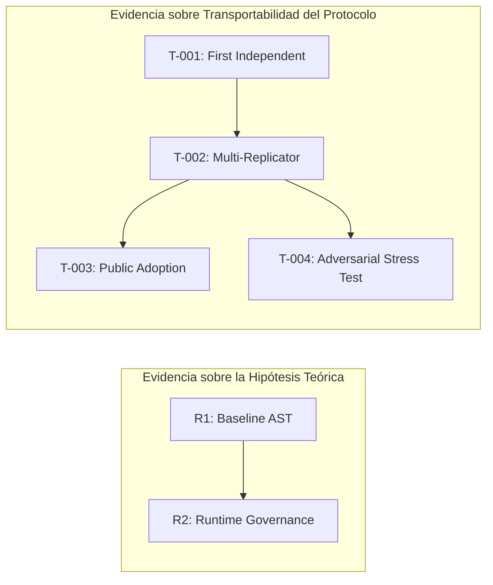

# REPLICATION_SPEC.md: Especificación Científica de Replicabilidad de TAKT (v1.2 / R2)

**Versión:** 1.2-R2  
**Estado:** Frozen / Inmutable  
**Objetivo:** Establecer la especificación rigurosa para evaluar la replicabilidad autónoma e independiente de la teoría TAKT y su protocolo de observación.

---

## 1. Criterio de Éxito Primario

Una replicación de TAKT se considera **satisfactoria** si y solo si:

> **Un investigador o desarrollador independiente, sin interacción directa ni mediación del autor tras recibir el paquete de replicación, implementa un adaptador válido para un dominio no contemplado originalmente, ejecuta la recolección de trazas y obtiene un informe reproducible conforme al protocolo, documentando de forma transparente cualquier fricción o ambigüedad encontrada.**

---

## 2. Hipótesis Científica de Replicabilidad ($H_{rep}$)

* **$H_{rep,0}$ (Hipótesis Nula):** El protocolo TAKT depende de conocimiento tácito del autor; un tercero independiente no puede implementar un adaptador ni reproducir la conservación de estructura sin aclaraciones fuera de banda.
* **$H_{rep,1}$ (Hipótesis Alternativa):** La suficiencia estructural y la convergencia observacional son invariantes al investigador. Un adaptador construido únicamente a partir de la especificación operativa produce trazas que satisfacen los teoremas de convergencia de TAKT.

---

## 3. Reglas de Modificación y Permisibilidad

Para preservar la validez científica, el marco de replicación distingue entre elementos modificables y elementos prohibidos:

### 3.1. Modificaciones Permitidas (Libertad del Replicador)
* **Dominio Target:** El replicador es libre de elegir cualquier dominio discreto o semi-discreto (ej. robótica simulada, análisis de AST, protocolos de red, agentes conversacionales, juegos de estrategia).
* **Lenguaje de Implementación del Adaptador:** El adaptador puede escribirse en cualquier lenguaje (Python, Rust, TypeScript, C++, Go) siempre que cumpla la interfaz de comunicación JSON/Schema de TAKT.
* **Generación de Traza Interna:** La instrumentación interna del sistema bajo prueba es decisión del replicador.

### 3.2. Modificaciones Prohibidas (Restricciones Científicas)
* **Definición de Métricas:** Prohibido alterar las fórmulas matemáticas de $H_{enrichment}$, regret $R_2$ o las cotas formales de convergencia $\varepsilon$.
* **Oráculos e Intervenciones Directas del Autor:** Prohibida cualquier consulta informal o soporte técnico del autor original durante la construcción del adaptador y ejecución del experimento.
* **Filtrado Selectivo de Trazas:** Prohibido descartar ejecuciones o trazas sin justificación metodológica registrada en el informe final.

---

## 4. Criterios de Éxito y Fracaso

| Criterio | Condición de Éxito | Condición de Fracaso / Falsación |
| :--- | :--- | :--- |
| **Autonomía del Adaptador** | El adaptador supera el `self-check` automático sin intervención externa. | El replicador no logra hacer pasar el `self-check` sin modificar las reglas teóricas o consultar al autor. |
| **Integridad de Esquema** | El 100% de las trazas emitidas cumplen el esquema JSON estricto del protocolo. | Existen trazas malformadas o campos omitidos no documentados. |
| **Reproducibilidad** | Un tercero puede re-ejecutar el script de evaluación con los artefactos entregados y obtener métricas dentro de $\pm 1\%$ de margen numérico. | Variabilidad estocástica no controlada o falta de determinismo en semillas sin registrar. |
| **Cierre de Conocimiento Tácito** | Todas las fricciones halladas se traducen en entradas identificadas en el log audit de conocimiento tácito. | El informe oculta fricciones o asume pasos no documentados. |

---

## 5. Arquitectura del Programa Experimental: Serie R vs. Serie T

Para evitar la confusión entre evaluar la teoría y evaluar el protocolo, TAKT separa formalmente el programa de investigación en dos series complementarias de experimentos:

### 5.1. Serie R (Representación e Hipótesis Teórica)
* **Pregunta de Investigación:** *¿Bajo qué condiciones una representación es estructuralmente suficiente para una decisión?*
* **Métricas Clave:** $H_{enrichment}$, $R_2$ (regret), cotas de convergencia $\varepsilon$.

### 5.2. Serie T (Transportabilidad del Protocolo)
* **Pregunta de Investigación:** *¿Es el protocolo científico claro y autocontenido para que un tercero genere evidencia objetiva sin intervención del autor?*
* **Experimentos Programados:**
  * **T-001 (First Independent Replication):** Evalúa si un replicador Nivel 3 logra completar el protocolo sin asistencia. Variable primaria: *¿Fue ejecutable el protocolo autónomamente?*
  * **T-002 (Multi-Replicator Study):** Múltiples investigadores independientes en dominios distintos. Mide distribuciones de tiempo ($T_{first\_exp}$), supuestos ($N_{assumptions}$) y fricción.
  * **T-003 (Public Replication):** Adopción espontánea por la comunidad a través de la documentación pública (Nivel 4).
  * **T-004 (Adversarial Replication):** Desafío explícito a investigadores externos para intentar falsificar la teoría, encontrar contraejemplos o identificar dominios límite donde TAKT no aplique.

---

## 6. Taxonomía de Niveles de Independencia (Niveles 0-4)

Para mitigar el sesgo de selección y evaluar la **evidencia acumulada de transportabilidad**, cada réplica se clasifica según su grado de aislamiento:

* **Nivel 0 (Baseline del Autor):** Réplica realizada por el autor original o equipo fundador.
* **Nivel 1 (Colaboradores Cercanos):** Réplica por colaboradores del proyecto que han mantenido contacto directo continuo.
* **Nivel 2 (Conocedores de TAKT):** Desarrolladores o investigadores familiarizados con la teoría que no han participado en su diseño ni código.
* **Nivel 3 (Investigadores Independientes):** Investigadores ajenos a TAKT que reciben el paquete de replicación formal sin canal directo de soporte.
* **Nivel 4 (Public Transportability):** Equipos externos que descubren e implementan TAKT únicamente a través de la documentación pública publicada, sin contacto directo previo.

---

## 6. Métricas de Fricción del Protocolo (El Protocolo como Sistema Observable)

El propio protocolo de replicación es tratado como un **sistema bajo observación**. Se miden cuantitativamente los siguientes indicadores de fricción:

| Métrica de Fricción | Indicador / Significado | Meta de Madurez |
| :--- | :--- | :--- |
| **$T_{first\_exp}$** | Tiempo (horas) transcurrido hasta el primer experimento válido con `self-check`. | $< 4$ horas |
| **$N_{assumptions}$** | Número de supuestos/decisiones no escritas tomadas por el replicador. | Se reduce a $0$ con las réplicas. |
| **$N_{consults}$** | Número de consultas o aclaraciones requeridas al autor original. | **Strictly $0$** para Nivel $\ge 3$. |
| **$N_{self\_check\_err}$** | Número de errores atrapados autónomamente por la suite `self-check`. | Diagnóstico claro sin falsos positivos. |
| **$\Delta_{doc}$** | Número de entradas añadidas a `TACIT_AUDIT.md` tras la réplica. | Mide la captura de conocimiento tácito. |

---

## 7. Modalidades de Replicación

El marco admite dos modalidades de replicación independiente:

### Modalidad A: Replicación Abierta
El replicador conoce la teoría TAKT y las hipótesis de conservación estructural. Evalúa si su dominio verifica o falsifica las predicciones teóricas.

### Modalidad B: Replicación Ciega (Blind Replication)
Al replicador se le entrega únicamente el `REPLICATION_KIT/` y las instrucciones de interfaz del adaptador, **omitiendo las predicciones esperadas sobre métricas o comportamientos de regret**.
* **Objetivo:** Eliminar el sesgo de expectativa (*observer bias*) en la toma de decisiones durante la construcción del adaptador.
* El replicador simplemente reporta los datos observados; la evaluación contra las hipótesis teóricas la realiza el framework de análisis automático.

---

## 8. Entregables Obligatorios del Replicador

Cualquier réplica para ser considerada válida dentro del registro oficial (`REPLICATION_LOG.md`) debe aportar:

1. Código fuente del adaptador y scripts de instrumentación.
2. Log de auto-verificación ejecutado (`self-check`).
3. Dataset de trazas recolectadas.
4. Informe completado siguiendo exactamente `REPLICATION_REPORT_TEMPLATE.md`.

