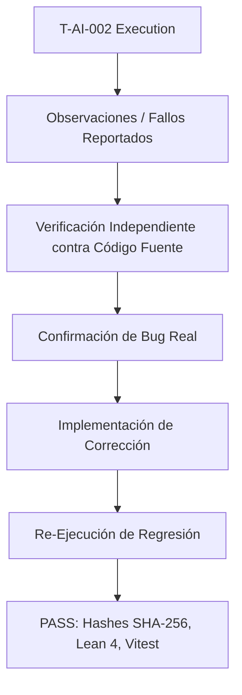

# T-AI-002: Matriz de Verificación y Cadena Causal de Correcciones

**Identificador:** T-AI-002  
**Evaluador:** Gemini 3.6 Flash  
**Fecha:** 2026-07-24  
**Declaración de Alcance:**  
> *Gemini 3.6 Flash formuló observaciones que, tras verificación independiente contra el código fuente, llevaron a identificar y corregir varios defectos del paquete de replicación. Esta ejecución demuestra la utilidad de los agentes de IA para el saneamiento de empaquetado, pero no constituye evidencia suficiente de transportabilidad social ni de validez teórica.*

---

## 1. Cadena Causal Metodológica

---

## 2. Matriz de Precisión de Observaciones

| Observación Emitida por el Modelo | Verificación en Código | Resultado | Acción Ejecutada |
| :--- | :--- | :--- | :--- |
| **Inclusión de `gitCommit` en Hash SHA-256** | `DatasetWriter.ts#L85` incluía `dataset.provenance.gitCommit` dentro de `contentToHash`. | **Confirmada (Bug Real)** | Removido `gitCommit` de `contentToHash`. Hashes ahora invariantes ante commits. |
| **Typo `evsiScore` en Meta-Audit** | `exp-001-meta-audit.ts#L27` leía `evsiScore` en lugar de `evsiPriority`. | **Confirmada (Bug Real)** | Corregido a `evsiPriority`. |
| **Typo `epsilonTotal` en Meta-Audit** | `exp-001-meta-audit.ts#L45` leía `epsilonTotal` en lugar de `totalError`, generando `NaN` $\to$ `null`. | **Confirmada (Bug Real)** | Corregido a `totalError`. `netValueEnrichment` restablecido. |
| **Explicación Incurrecta en `troubleshooting.md`** | `troubleshooting.md` atribuía fallos a timestamp cuando `gitCommit` era la causa real. | **Confirmada (Doc Drift)** | Actualizada la causa raíz en `troubleshooting.md`. |
| **Conteo Desactualizado de Tests en `README.md`** | `README.md` afirmaba 131 tests en 51 archivos (Vitest corre 280 tests en 73 archivos). | **Confirmada (Doc Drift)** | Actualizado `README.md` a 280 tests en 73 archivos. |

---

## 3. Resultados de Regresión Post-Saneamiento

1. **Validación Criptográfica:** `validation-script.ts` finalizado con éxito (`ALL CRYPTOGRAPHIC DATASET HASHES VERIFIED SUCCESSFULLY`).
2. **Compilación Lean 4:** `lake build` en `takt-formal/` completó con **0 errores y 0 sorrys** (226 empleos).
3. **Suite Vitest:** **280/280 tests pasados** en 73 archivos.
