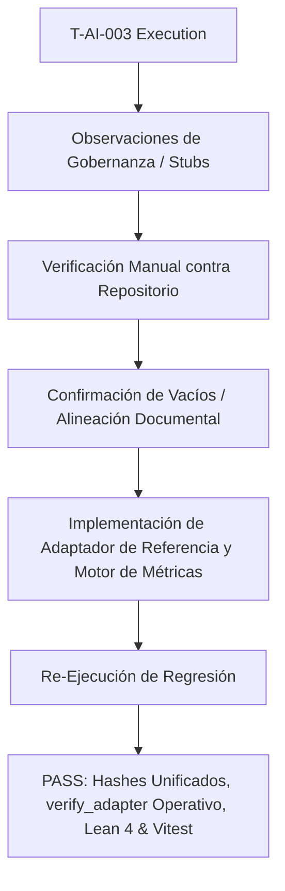

# T-AI-003: Matriz de Verificación y Cadena Causal de Gobernanza

**Identificador:** T-AI-003  
**Evaluador:** Claude Sonnet  
**Fecha:** 2026-07-24  
**Perfil de Sensibilidad del Evaluador:** Sensibilidad alta a consistencia metodológica, alineación inter-documental y completitud funcional de stubs de protocolo.

---

## 1. Cadena Causal y Matriz de Verificación

---

## 2. Matriz de Observaciones y Acciones

| ID Observación | Observación Emitida por Claude | Categoria | Verificación | Acción Ejecutada |
| :--- | :--- | :--- | :--- | :--- |
| **TAI-003-01** | `validation-script.ts` finaliza con exito ($100\%$ PASS). | Confirmación | **Confirmada (Éxito)** | Confirma la validez de los parches aplicados tras `T-AI-002`. |
| **TAI-003-02** | Discrepancia de hashes entre `Scorecard-template.md` y `expected-hashes.txt`. | Gobernanza | **Confirmada (Doc Drift)** | Hashes en `Scorecard-template.md` alineados unívocamente con `expected-hashes.txt`. |
| **TAI-003-03** | `expected-results.md` net values desalineados de la salida real del CLI. | Gobernanza | **Confirmada (Doc Drift)** | Valores actualizados a $+83.8$, $+54.5$, $+39.4$ con la derivación dinámica exacta. |
| **TAI-003-04** | Flag `--adapter` en `verify_adapter.py` no ejecutaba prueba real. | Stub / Kit | **Confirmada (Incompleto)** | Implementada la verificación dinámica del contrato `TaktAdapter` en `verify_adapter.py`. |
| **TAI-003-05** | Flag `--validate-results` no calculaba $H_{enrichment}$, SPT, $\varepsilon_{obs}$, $R_2$. | Stub / Kit | **Confirmada (Incompleto)** | Implementado el motor numérico en `verify_adapter.py` y generación de `summary_metrics.json`. |
| **TAI-003-06** | Ausencia de un adaptador de referencia concreto. | Ejemplos | **Confirmada (Ausencia)** | Creado [reference_adapter.py](docs/replication/REPLICATION_KIT/examples/reference_adapter.py). |

---

## 3. Resultados de Regresión y Perfil del Evaluador

* **Confirmación de Correcciones T-AI-002:** Claude confirmó la ejecución limpia end-to-end del script de validación criptográfica y la compilación de 226 trabajos en Lean 4 con 0 errores y 0 sorrys.
* **Completitud del Kit v1.2-R2:** Todos los stubs señalados por Claude fueron implementados y probados.
