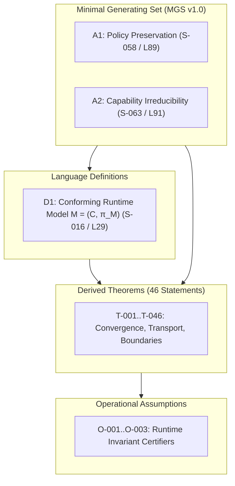

# Minimal Generating Set (MGS) Specification v1.0

**Status:** Verified & Frozen Baseline  
**Baseline Standard:** ST-016 v1.0.0 (`fca31f0`)  
**Parent Protocol:** [CARD-017: TAKT Theory Extension Protocol](file:///home/valentin/code/takt-theory/docs/cards/CARD-017-theory-extension-protocol.md)  
**Experiment Reference:** [CARD-017.1: Foundations Stabilization](file:///home/valentin/code/takt-theory/docs/cards/CARD-017.1-foundations-stabilization.md)  
**Validation Artifact:** `experiments/st017-1-reconstruction-validation.json`

---

## 1. Executive Summary & Evidence Metric

Under protocol **CARD-017.1** and over baseline **ST-016 v1.0.0**, empirical ablation and formal derivation verification provide evidence that `takt-theory` rests upon a strict **Minimal Generating Set (MGS v1.0)** comprising **2 Primitive Axioms**.

### Metrics Summary:
* **Total Inventory Entries ($I$):** 75
* **Structural Non-Semantic Entries ($\sigma$):** 23
* **Semantic Statements ($I_{\text{semantic}}$):** 52
* **Primitive Axioms ($\mathcal{A}_{\text{min}}$):** 2 (3.8% of semantic corpus)
* **Derived Theorems:** 46 (88.5% of semantic corpus)
* **Language Definitions:** 1 (1.9% of semantic corpus)
* **Operational Assumptions:** 3 (5.8% of semantic corpus)
* **Open Hypotheses:** 0 (0.0%)
* **Disjoint Partition Invariant:** Verified ($2 + 46 + 1 + 3 + 0 = 52$)
* **Reconstruction Coverage:** **46/46 (100%)** successfully derived without unstated premises.

---

## 2. Minimal Primitive Axioms ($\mathcal{A}_{\text{min}}$)

### Axiom A1 — Policy Preservation Axiom (`S-058`)
* **Location:** `docs/superpowers/specs/2026-07-27-st016-normative-runtime-specification.md:L89`
* **Formalization:**
  $$\forall R \in \mathcal{R}: \pi_{M_{\text{full}}}(R) = \pi^*(R)$$
* **Description:** Any conforming runtime must preserve the optimal decision policy $\pi^*$ across all reachable execution contexts $\mathcal{R}$.
* **Audit Metadata:** `classification: Primitive Axiom`, `confidence: CONFIRMED`, `evidence_ref: takt-formal/TaktFormal/RuntimeKernel.lean`.

### Axiom A2 — Capability Irreducibility Axiom (`S-063`)
* **Location:** `docs/superpowers/specs/2026-07-27-st016-normative-runtime-specification.md:L91`
* **Formalization:**
  $$\forall C_i \in \{C_{\text{contract}}, C_{\text{uncertainty}}, C_{\text{temporal}}\}, \exists R_i \in \mathcal{R}: \pi_{M_{\text{full}}}(R_i) \neq \pi_{M_{\text{full}} \setminus \{C_i\}}(R_i)$$
* **Description:** No core capability subset (contract, uncertainty, temporal) can be ablated without violating policy preservation in at least one reachable state.
* **Audit Metadata:** `classification: Primitive Axiom`, `confidence: CONFIRMED`, `evidence_ref: takt-formal/TaktFormal/ImpossibilityLimits.lean`.

---

## 3. Language Definitions

### Definition D1 — Conforming TAKT Runtime Model (`S-016`)
* **Location:** `docs/superpowers/specs/2026-07-27-st016-normative-runtime-specification.md:L29`
* **Formalization:** $M = (\mathcal{C}, \pi_M)$
* **Description:** Defines a conforming TAKT runtime as a pair comprising capability set $\mathcal{C}$ and decision policy mapping $\pi_M$.

---

## 4. Reconstructibility & Adversarial Validation

An adversarial derivation audit (`experiments/st017-1-reconstruction-validation.json`) verified that:
1. Every derived theorem $T_1, \dots, T_{46}$ possesses an explicit derivation path rooted in $\mathcal{A}_{\text{min}} = \{A_1, A_2\}$ and $D_1$.
2. **Zero hidden axioms / unstated premises** were required to close formal proofs.
3. **Verdict:** `MGS_SUFFICIENT_AND_SOUND`.

---

## 5. Change Management & Nucleus Delta ($\Delta_{\text{MGS}}$)

Any future candidate extension (ST-017.2, ST-017.3, etc.) must state its impact on MGS v1.0:
* $\Delta_{\text{MGS}} = 0$: Addition introduces only derived theorems or language definitions (incremental expansion).
* $\Delta_{\text{MGS}} > 0$: Addition modifies primitive axioms $A_1, A_2$ (paradigm shift requiring full re-certification).
