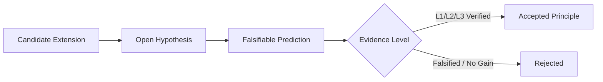
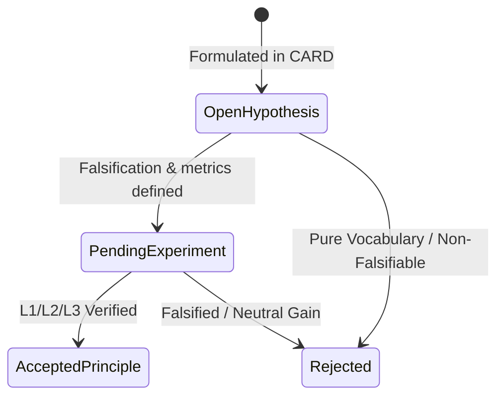

# ST-017 Evolution Protocol Design

## 1. Purpose

Define the research architecture for evolving `takt-theory` under **CARD-017 Governance** constraints.

This document does **not** introduce new theoretical claims. It defines the experimental structure, research layers, and verification pipelines through which future theoretical candidate extensions emerge, undergo empirical/formal testing, and transition to accepted status or rejection.

---

## 2. Baseline & Lineage

* **Current Accepted Foundation:** ST-016 v1.0.0 (`fca31f0` frozen baseline)
* **Active Research Line (ST-017):** Witness Transportability & Cross-Implementation Equivalence
* **Governance Standard:** [CARD-017: TAKT Theory Extension Protocol](file:///home/valentin/code/takt-theory/docs/cards/CARD-017-theory-extension-protocol.md)

---

## 3. Evolution Rules & Promotion Pipeline

Every candidate extension to `takt-theory` must pass through the normative 5-stage pipeline:

No theoretical claim, metric, or structural directory may be merged into `takt-theory` main branches without passing through an explicit CARD and producing corresponding L1, L2, or L3 evidence artifacts.

---

## 4. Research Layers

### Layer 1 — Foundations
* **Purpose:** Formal invariants, minimal representation bounds, and primitive decision relations.
* **Target Evidence:** Level 1 Formal (Lean 4 proofs in `takt-formal/`)
* **Core Domains:** Decision preservation, representation equivalence, ordering relations, minimum required axioms.

### Layer 2 — Dynamics
* **Purpose:** Model system trajectory $S_t = (K_t, F_t, U_t) \xrightarrow{a_t} S_{t+1}$ post-decision.
* **Target Evidence:** Level 1 (Formal) & Level 2 (Experimental benchmarks)
* **Core Questions:** Predictability of friction accumulation $F_t$, stagnation thresholds, degradation frontiers.

### Layer 3 — Observability
* **Purpose:** Quantify decision-sufficiency $O(X)$ and minimal observation representations required for policy preservation.
* **Target Evidence:** Level 1 (Formal bounds) & Level 2 (Empirical sufficiency suites)
* **Core Questions:** Boundary between raw data volume and decision-relevant information models.

### Layer 4 — Coordination
* **Purpose:** Model multi-agent, orchestrator, and human-in-the-loop decision networks.
* **Target Evidence:** Level 2 (Empirical multi-agent experiments) & Level 3 (Operational runtime logs)
* **Core Questions:** Formulation and reduction of coordination friction $F_c = F_{\text{communication}} + F_{\text{verification}} + F_{\text{alignment}}$.

### Layer 5 — Operational Integration
* **Purpose:** Validate and enforce theoretical invariants directly inside the TAKT engine runtime kernel.
* **Target Evidence:** Level 3 Operational (Kernel integration & Vitest test suites in `cli/src/takt-core/`)
* **Core Questions:** Execution speed, runtime overhead, and real-world invariant adherence.

---

## 5. Research State Machine Integration

All research initiatives track their lifecycle explicitly according to the CARD-017 state machine:

---

## 6. Non-Goals

This evolution protocol explicitly **does NOT**:

* Create speculative concepts or vocabulary without testable predictions.
* Reorganize theory subdirectories prior to experimental confirmation.
* Perform superficial terminology optimization.
* Substitute intuitive consensus or narrative for formal or empirical evidence.

---

## 7. Initial Research Queue

Candidate research initiatives queued for independent CARD evaluation:

1. **ST-017.1 — Foundations Stabilization:** Disentangle necessary axioms vs. domain-specific hypotheses in ST-016 baseline.
2. **ST-017.2 — Friction Dynamics:** Empirical and formal modeling of state transition $S_t \to S_{t+1}$.
3. **ST-017.3 — Observability Theory:** Information-theoretic bounds on decision-preserving representations $O(X)$.
4. **ST-017.4 — Coordination Friction:** Quantifying alignment and verification overhead in multi-agent orchestration.

Each candidate initiative requires an independent CARD, explicit experiment harness, and verification before code/theory modification.
