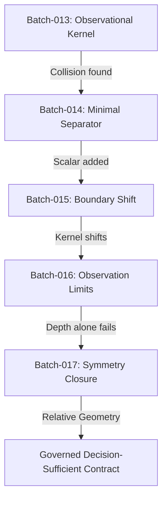

# TAKT Theoretical Synthesis: Batches 013–017

## Executive Summary

This report synthesizes the experimental and mathematical evolution of the TAKT representation pipeline across Batches 013 through 017. The project transitioned from search-based counterexample detection to a formal theory of **Governed Decision-Sufficient Representations**.

---

## 1. The Experimental Arc

### 1.1 Batch-013: Joint Observational Kernel
* **Question**: Does there exist a causal degradation that bypasses all joint topological and reliability sensors ($\Delta\Omega_0 = 0$) while producing regret?
* **Outcome**: **Confirmed (Scenario K)**. Found 211 silent graph configurations. Configuration #187 yielded a utility loss of **$13.58$** by swapping unobserved nodes.

### 1.2 Batch-014: Minimal Representational Dimension
* **Question**: What is the minimal representational dimension $\dim(X)_{min}$ needed to separate the Batch-013 witness?
* **Outcome**: **$\dim(X)_{min} = 1$**. Implementing a scalar summation of structural failure rates ($X_2$) successfully separated the witness.

### 1.3 Batch-015: The Shifted Kernel
* **Question**: Does the minimal refinement close the kernel or merely shift the blind spot?
* **Outcome**: **Shifted (Scenario B)**. By transposing two attribute-equivalent nodes (`'t'` and `'v3_next_next'`), the adversary bypassed the augmented representation $\Omega_1 = \Omega_0 \oplus X_2$ completely, yielding **$\text{Loss} = 1.00$**.

### 1.4 Batch-016: Limits of Depth
* **Question**: Can increasing local observation depth $k$ guarantee bounded regret?
* **Outcome**: **Falsified (Scenario C)**. The worst-case regret remained flat at $B(0) = B(1) = B(2) = 15.58$. Proved that more observation does not equal less silent regret if the representation is too invariant.

### 1.5 Batch-017: Equivalence Class Repair
* **Question**: Can we close the decision-changing symmetry gap without literal node labels?
* **Outcome**: **Symmetry Closed (Scenario A)**. Appending the relative shortest-path distance signature $X_{dist}(v) = (d_s(v), d_t(v))$ paired with node attributes successfully collapsed the symmetry mismatch set to exactly **0** ($|M_{X_{dist}}| = 0$).

### 1.6 Batch-018: Global $\varepsilon$-Decision Sufficiency
* **Question**: Does local symmetry closure on one orbit generalize to global decision sufficiency ($\varepsilon = 0$) across all 38,760 directed graphs?
* **Outcome**: **Falsified (Scenario C)**. The global representational regret remained flat at $\varepsilon(R_{dist}) = 15.58$, with 132 conflict bins. While $R_{dist}$ successfully split the space into 10,743 bins (down from 50), residual symmetries from non-isomorphic graphs sharing identical distance signatures still allow maximum regret to hide.

### 1.7 Batch-019: Compositional Path Sufficiency
* **Question**: Does preserving the compositional path sequences $X_{path}$ to target sink `'t'` break the residual symmetries and achieve global sufficiency?
* **Outcome**: **Falsified (Scenario C)**. The global regret bound remained flat at $\varepsilon(R_{path}) = 15.58$, though conflict bins decreased to 122. This reveals a fundamental interaction between path sequences and **epistemic limits**: two configurations can share the same directed path sequence to `'t'` while `'t'` occupies different undirected distances from `'s'`. At $k=2$, `'t'` is observed in one graph but unobserved in the other, altering active edges counts and action utilities silently.

### 1.8 Batch-020: Observational Activation Sufficiency
* **Question**: Does preserving the observation-aware active subgraph structure $X_{activation}$ under $O_k$ break the symmetries and achieve global sufficiency?
* **Outcome**: **Falsified (Scenario C - Strict Improvement)**. The global regret bound dropped from $15.58$ to **$13.58$**, with conflict bins dropping from 122 to 23. This confirms a strict improvement but leaves residual symmetries open due to **intermediate-path label-blindness**: two configurations can share identical active edge counts and active node attribute multisets, but the path from an intermediate failed node to `'t'` can be active or blocked depending on the specific intermediate nodes it traverses. Label-blindness prevents the representation from distinguishing these topologies.

---

## 2. Core Mathematical Theorem of TAKT

The security of a representation contraction $R: S \rightarrow R(S)$ is defined by the containment of its equivalence classes in the decision equivalence classes:

\[
\boxed{
\sim_R \ \subseteq \ \sim_D
}
\]

or equivalently, in terms of kernels:

\[
\boxed{
\ker(R) \subseteq \ker(D)
}
\]

* A representation $R$ is **decision-sufficient** if and only if any two states $S$ and $S'$ mapped to the same representation yield the same optimal action:
  \[
  R(S) = R(S') \implies a^*(S) = a^*(S')
  \]
* **Local vs. Global Sufficiency Gap**: Batch-018 to Batch-020 reveal that **local symmetry closure on a single orbit does not imply global decision sufficiency**. While relative coordinates $X_{dist}$, path invariants $X_{path}$, and activation structures $X_{activation}$ improve discrimination ($13,339$ bins vs $50$), residual non-isomorphic structures and differences in undirected observation status allow regret to hide.
* **The Epistemic Boundary Mismatch**: Symmetries are not just structural; they are **observational**. If two configurations share the same directed paths, but differ in undirected distances that determine whether target nodes fall inside the observer's horizon $O_k$, their active subgraphs differ, decoupling representational identity from utility equivalence.
* **Intermediate-Path Label-Blindness**: Symmetries also hide in the intermediate paths from failed nodes to target landmarks. If the path from a failed node to `'t'` is active or blocked depending on the specific labels of the intermediate nodes, a label-blind multiset representation cannot distinguish the two states, leaving a residual regret bound of $13.58$.
* **Quantitative Governing Policy**: The safety of a contraction is governed by measuring $\varepsilon(R)$. If $\varepsilon(R) = 0$, we have exact sufficiency. For $\varepsilon(R) > 0$, TAKT must define a threshold policy $\tau$, rejecting or escalating representations exceeding acceptable risk limits.

