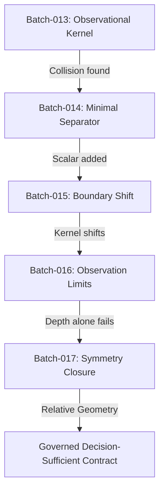

# TAKT Theoretical Synthesis: Batches 013–017

## Executive Summary

This report synthesizes the experimental and mathematical evolution of the TAKT representation pipeline across Batches 013 through 017. The project transitioned from search-based counterexample detection to a formal theory of **Governed Decision-Sufficient Representations**.

---

## 1. The Experimental Arc

### 1.1 Batch-013: Joint Observational Kernel
* **Question**: Does there exist a causal degradation that bypasses all joint topological and reliability sensors ($\Delta\Omega_0 = 0$) while producing regret?
* **Outcome**: **Confirmed (Scenario K)**. Found 211 silent graph configurations. Configuration #187 yielded a utility loss of **$13.58$** by swapping unobserved nodes.

### 1.2 Batch-014: Minimal Representational Dimension
* **Question**: What is the minimal representational dimension $\dim(X)_{min}$ needed to separate the Batch-013 witness?
* **Outcome**: **$\dim(X)_{min} = 1$**. Implementing a scalar summation of structural failure rates ($X_2$) successfully separated the witness.

### 1.3 Batch-015: The Shifted Kernel
* **Question**: Does the minimal refinement close the kernel or merely shift the blind spot?
* **Outcome**: **Shifted (Scenario B)**. By transposing two attribute-equivalent nodes (`'t'` and `'v3_next_next'`), the adversary bypassed the augmented representation $\Omega_1 = \Omega_0 \oplus X_2$ completely, yielding **$\text{Loss} = 1.00$**.

### 1.4 Batch-016: Limits of Depth
* **Question**: Can increasing local observation depth $k$ guarantee bounded regret?
* **Outcome**: **Falsified (Scenario C)**. The worst-case regret remained flat at $B(0) = B(1) = B(2) = 15.58$. Proved that more observation does not equal less silent regret if the representation is too invariant.

### 1.5 Batch-017: Equivalence Class Repair
* **Question**: Can we close the decision-changing symmetry gap without literal node labels?
* **Outcome**: **Symmetry Closed (Scenario A)**. Appending the relative shortest-path distance signature $X_{dist}(v) = (d_s(v), d_t(v))$ paired with node attributes successfully collapsed the symmetry mismatch set to exactly **0** ($|M_{X_{dist}}| = 0$).

---

## 2. Core Mathematical Theorem of TAKT

The security of a representation contraction $R: S \rightarrow R(S)$ is defined by the containment of its equivalence classes in the decision equivalence classes:

\[
\boxed{
\sim_R \ \subseteq \ \sim_D
}
\]

or equivalently, in terms of kernels:

\[
\boxed{
\ker(R) \subseteq \ker(D)
}
\]

* A representation $R$ is **decision-sufficient** if and only if any two states $S$ and $S'$ mapped to the same representation yield the same optimal action:
  \[
  R(S) = R(S') \implies a^*(S) = a^*(S')
  \]
* Refinement is not about multiplying sensors, but about **pruning spurious symmetries** ($G_R \subseteq G_D$). Anchoring node attributes to relative geometric coordinates from decision landmarks (`s`, `t`) breaks all spurius symmetries, achieving local decision sufficiency.
